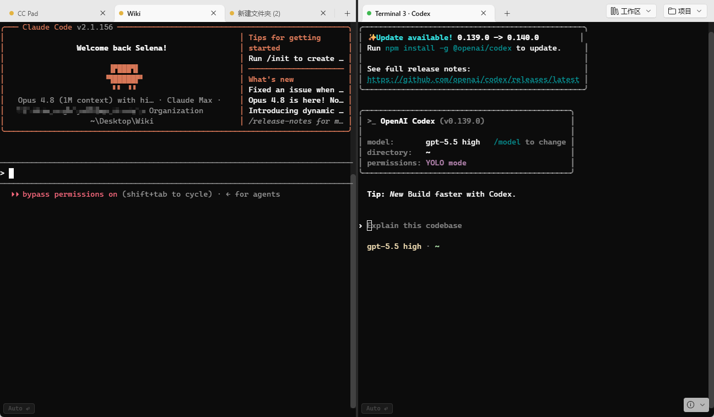
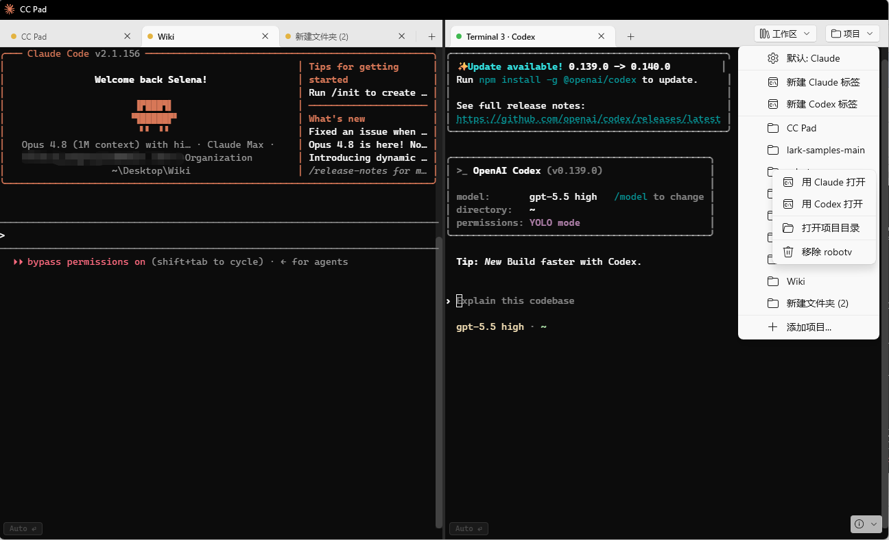
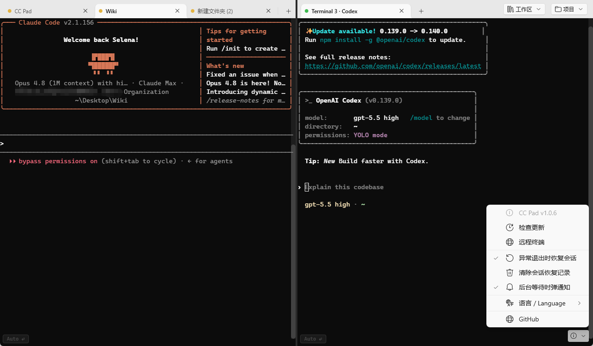

<p align="center">
  
</p>

<h1 align="center">CC Pad</h1>

<p align="center">
  A multi-session Claude Code workbench — run multiple Claude Code sessions in one window.
</p>

<p align="center">
  <a href="README.zh-CN.md">中文文档</a> · <a href="LICENSE">License (GPL-3.0)</a>
</p>

<p align="center">
  <em>⚡ A community fork of <a href="https://github.com/nuomiaa/CCPad">nuomiaa/CCPad</a> — adds Codex CLI support, per-tab status lights with background "your turn" notifications, a 9-language switchable UI, Chrome-style session recovery, and a resilient terminal. Licensed under GPL-3.0; original copyright © the upstream authors. See <a href="#fork-changes">Fork Changes</a>.</em>
</p>

---

## Features

- **Split Panes** — Vertical and horizontal splits with draggable dividers. Navigate between panes with `Alt+Arrow` keys.
- **Tabs** — Multiple tabs per pane, reorderable, with tab prewarming for instant creation.
- **Workspaces** — Save and restore your entire layout (splits, tabs, working directories, window state) as `.ccpad-workspace` files. Auto-detects workspace files on startup.
- **Project Quick-Access** — Pin frequently-used directories for one-click new tabs.
- **Windows ConPTY** — Native pseudo-console integration. Runs any CLI tool — PowerShell, cmd, bash, python, node, git, etc.
- **xterm.js Rendering** — Full terminal emulation via xterm.js hosted in WebView2, with Cascadia Code font.
- **Mica Backdrop** — Native Windows 11 translucent material.
- **Web Remote Terminal** — Built-in HTTP/WebSocket server lets you view and control any session from a browser on the same LAN. Optional token authentication. Touch-friendly UI with on-screen keys for mobile devices.
- **Context Menu Integration** — Right-click any folder in Explorer to open it in CC Pad.
- **File Association** — Double-click `.ccpad-workspace` files to open them directly.
- **Dual-CLI (Claude + Codex)** *(fork)* — Run Claude and Codex tabs side by side in one window. Pick a default CLI; open any pinned project with either CLI.
- **Tab Status Lights** *(fork)* — Each tab shows a colored dot at a glance: **green** = the AI is working, **amber** = it's waiting for your input, **red** = the CLI has exited. Works for both Claude (via official hooks) and Codex (via its `notify` config), so you always know which session needs you without switching tabs.
- **Background "Your Turn" Notifications** *(fork)* — When a session in a background tab starts waiting for you, CC Pad pops a Windows toast; click it to jump straight to that tab. Toggle it from the About menu.
- **Multi-Language UI** *(fork)* — Switch the interface language live (no restart) between **English, 简体中文, 繁體中文, Deutsch, 日本語, Français, 한국어, Español, Italiano**. First run follows your Windows display language. Covers the app UI, the Explorer right-click labels, and the remote web page.
- **One-Key Conversation Resume** *(fork)* — After Claude exits, press **↑** at the prompt to pre-fill the exact `claude --resume <id>` command (reviewed before you hit Enter), and the tab's red dot flips back to amber once the conversation is restored.
- **Session Recovery** *(fork)* — Chrome-style crash recovery (on by default): after an unexpected exit, restore your tabs and working directories.
- **Resilient Terminal** *(fork)* — When the CLI exits, the terminal drops into a shell in the same directory (scrollback preserved) instead of dying; press Enter to relaunch the CLI.
- **File Manager** *(fork)* — A right-docked panel to browse the active session's project directory, toggled from the bottom-right toolbar.
- **Command Staging** *(fork)* — Queue your next prompts while the AI is busy; CC Pad auto-sends them one at a time as soon as the session goes idle. Toggle it with the 寄存 button or ``Alt+` `` in a pane; `Alt+V` in the staging box saves a clipboard image to a PNG and queues its path (Claude attaches images by path).
- **Switchable Theme** *(fork)* — Dark (the default all-black skin), Light (translucent Mica), or System (follows Windows) — switched live from the About menu.

## Screenshots

Claude Code and OpenAI Codex running side by side in split panes — note the colored status dot on each tab:



Open any pinned project with either CLI from the Projects menu:



The About menu — session recovery, background "your turn" notifications, and the language switcher:



## Installation

### Installer (Recommended)

Download the latest `CCPad-Setup-x64.exe` from the [Releases](../../releases) page and run it.

### Build from Source

**Prerequisites:**
- [.NET 8.0 SDK](https://dotnet.microsoft.com/download/dotnet/8.0)
- [Windows App SDK 1.8+](https://learn.microsoft.com/windows/apps/windows-app-sdk/)
- Windows 10 (Build 17763) or later

```bash
# Clone (this fork)
git clone https://github.com/vv-l/CCPad.git
cd CCPad

# Build (Debug)
dotnet build CCPad/CCPad.csproj

# Build (Release, x64)
dotnet publish CCPad/CCPad.csproj -c Release -r win-x64

```

Supported targets: `win-x64`, `win-x86`, `win-arm64`.

## Usage

### Launch

```bash
# Open in current directory
CCPad.exe

# Open a specific folder
CCPad.exe "C:\Projects\my-app"

# Open a workspace file
CCPad.exe my-project.ccpad-workspace
```

When launched without arguments, CC Pad auto-detects `.ccpad-workspace` files in the current directory and enters workspace mode.

### Keyboard Shortcuts

| Action | Shortcut |
|--------|----------|
| New tab | `Ctrl+T` |
| Close tab | `Ctrl+W` |
| Copy selection | `Ctrl+C` |
| Split right | `Alt+Shift+=` |
| Split down | `Alt+Shift+-` |
| Navigate panes | `Alt+Arrow Keys` |
| Close pane | `Ctrl+Shift+W` |

Right-click the terminal or a tab header for additional options.

### Web Remote Terminal

Access your terminal sessions from any browser on the same network:

1. Click the remote terminal button in the toolbar
2. Select your LAN address and optionally enable token authentication
3. Open the displayed URL on another device (phone, tablet, another PC)
4. Select a session from the sidebar to view and control it in real-time

Features:
- **Live mirroring** — See exactly what's on the desktop terminal
- **Full keyboard input** — Type commands remotely
- **Touch controls** — On-screen arrow keys, backspace, and enter for mobile devices
- **Session replay** — Recent terminal output is buffered for instant display when connecting
- **Secure** — Optional 16-byte token authentication

### Workspaces

Workspaces save your complete layout as a JSON file:

- **Split layout** — Pane tree structure with orientations and ratios
- **Tab states** — Name and working directory for each tab
- **Window state** — Size, position, and maximized state

Use the workspace button (top-right, visible in workspace mode) or the context menu to save/load workspaces. The default filename is the current directory name.

### Projects

Click the **Projects** button in any tab strip footer to manage pinned directories. Adding a project makes it available as a quick-launch option across all panes.

## Architecture

```
CCPad/
├── App.xaml.cs              # Entry point, startup, context menu registration
├── MainWindow.xaml.cs       # Window management, workspace mode, update UI
├── SplitHost.xaml.cs        # Binary split-tree layout engine
├── TabPanel.xaml.cs         # Tab lifecycle, project menu, status lights
├── TerminalPane.xaml.cs     # WebView2 + xterm.js host, session registration
├── UpdateChecker.cs         # GitHub release checker, auto-update
├── Terminal/
│   ├── ConPtySession.cs     # Windows ConPTY process management
│   └── PseudoConsoleApi.cs  # P/Invoke bindings for ConPTY
├── Web/
│   ├── WebTerminalServer.cs # ASP.NET Core Kestrel HTTP/WebSocket server
│   ├── WebTerminalSession.cs# WebSocket handler for remote mirroring
│   ├── TerminalSessionRegistry.cs # Session tracking + output ring buffer
│   ├── CliNotify.cs         # Loopback endpoint for Claude/Codex turn signals [fork]
│   └── WebTerminalHtml.cs   # Embedded web UI with xterm.js
├── Notify/
│   └── ToastService.cs      # Background "your turn" Windows toasts        [fork]
├── Localization/
│   └── Loc.cs               # 9-language string table + live switching     [fork]
├── Files/
│   └── FileManagerPanel.xaml.cs # Right-docked project file browser        [fork]
├── Controls/
│   └── GridSplitter.cs      # Draggable split ratio control
├── Settings/
│   ├── WorkspaceConfig.cs   # .ccpad-workspace file I/O
│   ├── ProjectConfig.cs     # Project list persistence
│   ├── AppConfig.cs         # App prefs (default CLI, language, toggles)  [fork]
│   ├── CliMode.cs           # Claude/Codex resolution + cmd /c wrapping   [fork]
│   ├── AppPaths.cs          # Data-root resolver (CCPAD_DATA_DIR override) [fork]
│   ├── ThemeManager.cs      # Dark/Light/System theme state + events      [fork]
│   └── SessionRecovery.cs   # Crash-recovery snapshots                    [fork]
└── Assets/
    └── xterm/               # xterm.js terminal emulator
```

**Rendering pipeline:** xterm.js (JavaScript) → WebView2 (Chromium) → WinUI 3 window

**Layout model:** Binary tree of `SplitNode` — each leaf is a `PaneNode` containing a `TabPanel`, each internal node is a `SplitContainerNode` with orientation and ratio.

## System Requirements

- Windows 10 version 1809 (Build 17763) or later
- WebView2 Runtime (bundled with Windows 11, auto-installed on Windows 10)

## Fork Changes

This is a community fork of [nuomiaa/CCPad](https://github.com/nuomiaa/CCPad) (based on upstream **v1.0.2**). Changes made in this fork:

### v1.4.0

- **File manager panel** — a right-docked file browser for the active session's project directory, toggled by the new **文件** button in the bottom-right cluster (`Files/FileManagerPanel.xaml`).
- **Command staging mode** — queue your next prompts while the AI is still working; CC Pad auto-sends them one at a time as soon as the session goes idle. Toggle it with the **寄存** button or ``Alt+` `` inside a pane. ``Alt+V`` in the staging box reads a clipboard image, saves it as a PNG under the temp folder, and queues its path (Claude Code attaches images referenced by path), since the staging input can't see the CLI's own clipboard read.
- **Smarter status lights** — the amber "your turn" light now self-corrects against stale hook signals: a hook can flip a pane to *waiting* mid-turn, so CC Pad only keeps it amber once output has gone quiet (a still-working CLI redraws its spinner continuously, which holds the light green). A fatal API-error banner (e.g. `API Error: 529 Overloaded`, 402 billing, 403 auth) now forces a **red** light and holds it across the turn-ending hook, even though the CLI stays alive at its prompt, until you retry.
- **Switchable theme (Dark / Light / System)** — the all-black skin is now a choice in the About menu; Light restores the translucent Mica look and System follows Windows. The chrome switches through XAML `ThemeDictionaries` (`App.xaml`) while the terminal panes re-style their xterm front-end live via `Settings/ThemeManager.cs`.
- **Isolated data directory** — set the `CCPAD_DATA_DIR` environment variable to give a second instance (a dev/demo build launched alongside the real install) a fully separate profile — prefs, projects, crash-recovery snapshot, lock files, hooks and logs — so it never cross-contaminates production session state. All data-root paths now flow through `Settings/AppPaths.cs`.
- **Bottom-right toolbar redesign** — a uniform **文件 / 回车 / 寄存 / 关于** button cluster (auto-confirm is now a first-class toggle button rather than a hidden switch). Version bumped to 1.4.0.

### v1.1.0

- **Tab status lights** — each tab carries a colored dot reflecting its session state: green (AI working), amber (waiting for your input), red (CLI exited). Driven by Claude's official hooks and Codex's `notify` config via a small loopback endpoint (`Web/CliNotify.cs`), so the signal is event-based rather than screen-scraped.
- **Background "your turn" notifications** — when a backgrounded session transitions to "waiting for input", CC Pad raises a Windows toast (`Notify/ToastService.cs`); activating it focuses the originating tab. Toggleable from the About menu and persisted in app prefs.
- **One-key conversation resume** — after Claude exits, pressing ↑ at the prompt pre-fills the resolved `claude --resume <id>` command for review before submission; the tab light returns to amber once the conversation resumes.
- **9-language switchable UI** — English, 简体中文, 繁體中文, Deutsch, 日本語, Français, 한국어, Español, Italiano, switched live without restart through a custom string table (`Localization/Loc.cs`) and a `LanguageChanged` event. First run follows the Windows display language; the selection covers the app chrome, the Explorer context-menu labels, and the remote web page, and is persisted in app prefs.
- **Adaptive top-right layout** — the Workspace/Projects buttons and the tab-strip reserve now size themselves from measured label widths instead of fixed margins, so long localized labels (e.g. "Espacio de trabajo", "Projekte") no longer overflow or clip. Version bumped to 1.1.0.

### v1.0.x

- **Dual-CLI (Claude + Codex)** — mixed Claude/Codex tabs in one window; PATH/PATHEXT executable resolution with `cmd /c` wrapping for `.cmd`/`.bat` (fixes `codex.cmd` "CreateProcess failed: 2"); default-CLI preference and per-tab CLI persisted across restarts.
- **Session recovery** — Chrome-style crash recovery (default on); state under `%LOCALAPPDATA%\CCPad\sessions\`; restores tabs and working directories.
- **Resilient terminal** — the pseudoconsole outlives its child process; on CLI exit it drops into `cmd.exe` (scrollback preserved) and offers an Enter-to-relaunch; reliable exit detection via `WaitForSingleObject`. On abnormal Claude exits it also prints the exact `claude --resume <id>` command (resolved from the on-disk session transcript) so the conversation can be recovered.
- **Ctrl+wheel zoom fix** — disabled WebView2's built-in page zoom, whose persistent `ZoomFactor` accumulated toward its ~5× ceiling so a long-lived pane could "zoom out but not in"; Ctrl+wheel now adjusts the terminal font size (clamped 8–40), with Ctrl `+` / `-` / `0` keyboard parity. Version bumped to 1.0.6.
- **Build fix** — disabled trimming, which had stripped `WinRT.Runtime` methods and crashed startup (`MissingMethodException`); version bumped to 1.0.4.

In keeping with GPL-3.0, the original copyright and license are preserved, and these modifications are documented here and in the commit history.

## License

This project is licensed under the [GNU General Public License v3.0](LICENSE), the same license as the upstream project. Original copyright © the upstream [nuomiaa/CCPad](https://github.com/nuomiaa/CCPad) authors; fork modifications © their respective contributors.

## Contributing

Contributions are welcome! Please open an issue first to discuss what you'd like to change.

1. Fork the repository
2. Create your feature branch (`git checkout -b feature/my-feature`)
3. Commit your changes
4. Push to the branch and open a Pull Request
