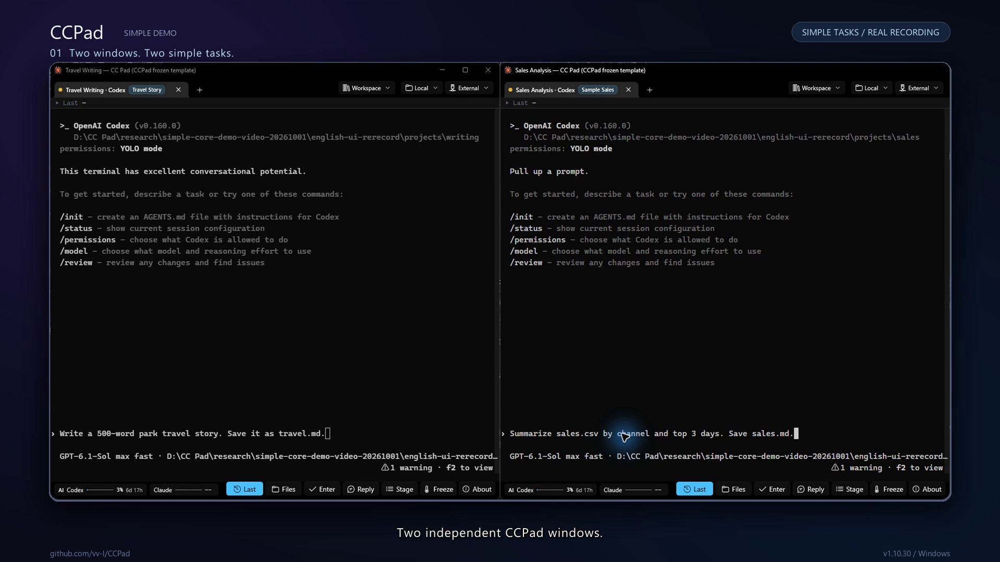
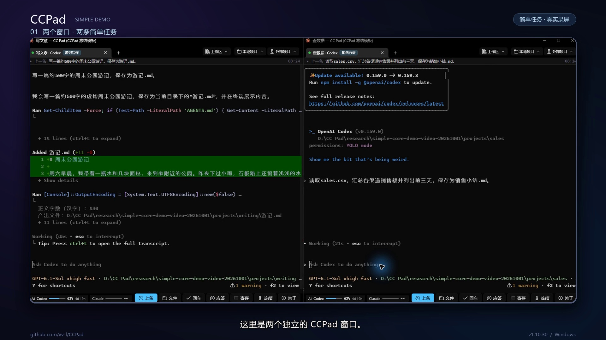
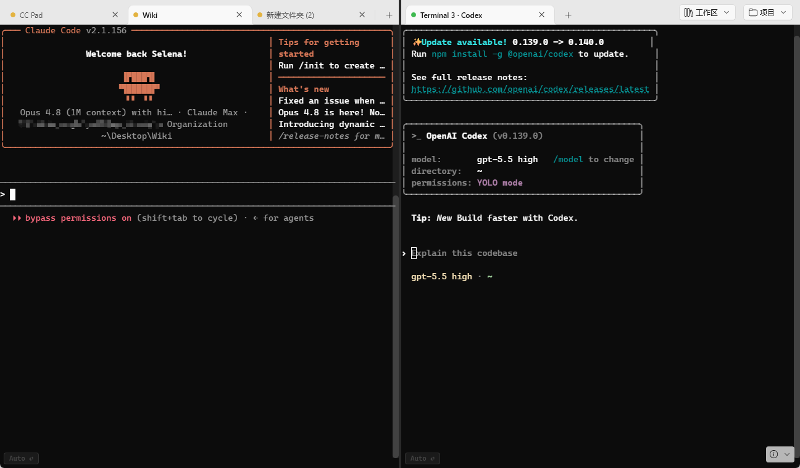
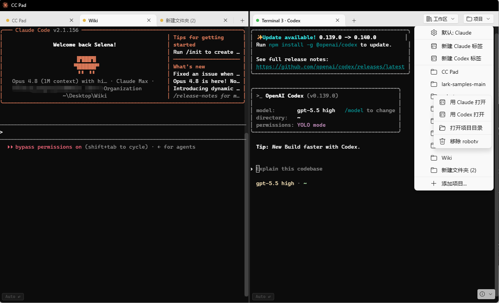
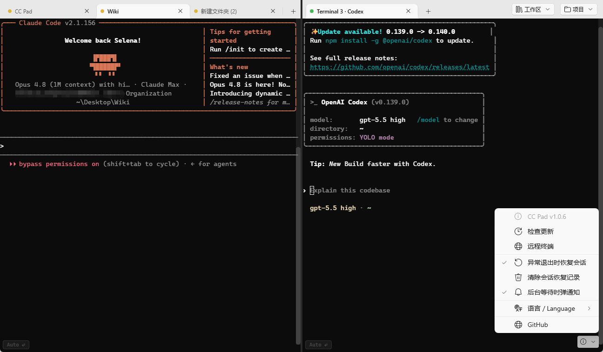
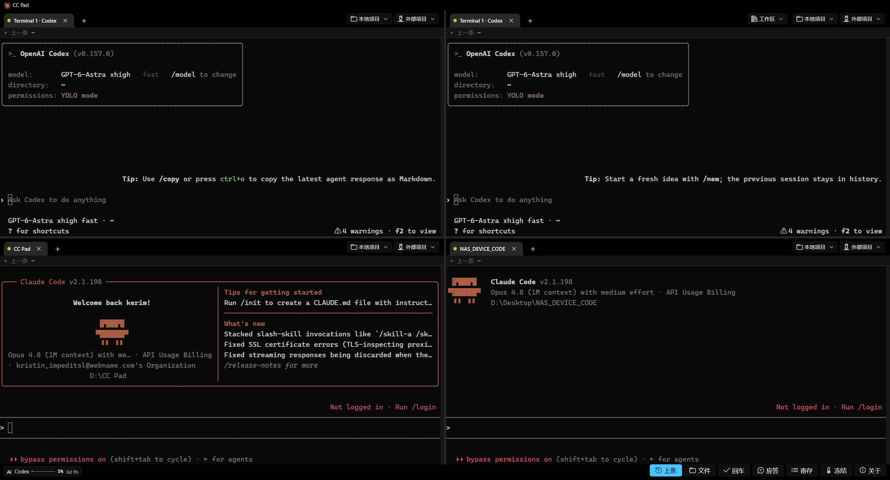
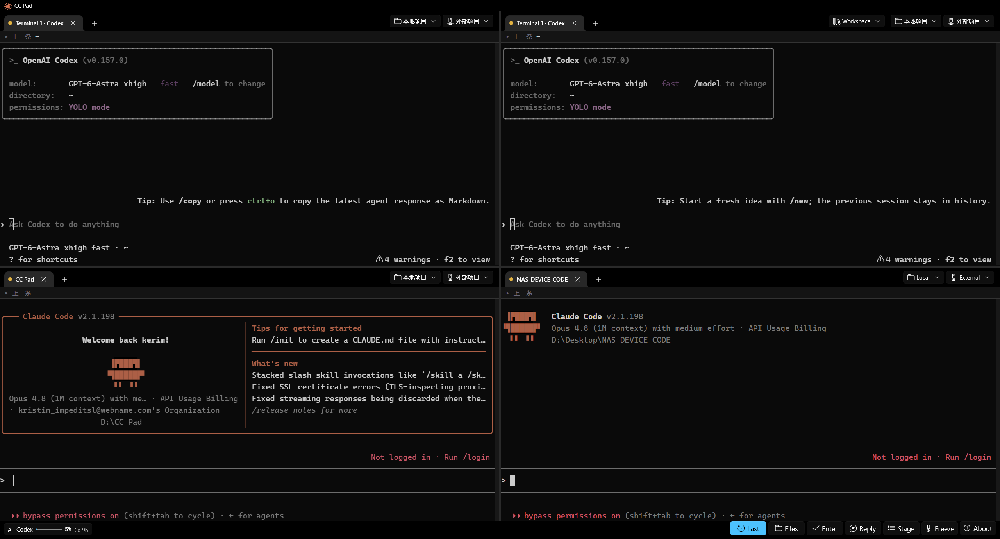
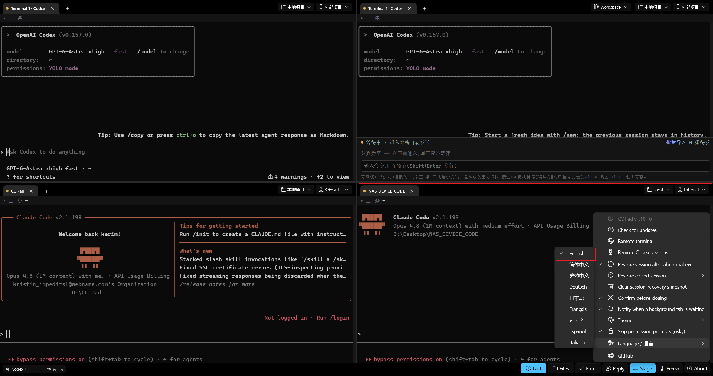
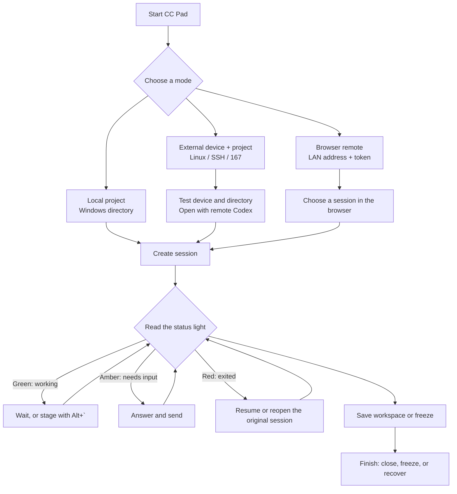

<p align="center">
  
</p>

<h1 align="center">CC Pad</h1>

<p align="center">
  A multi-session AI CLI workbench — run Claude Code, Codex, and remote Codex sessions in one window.
</p>

<p align="center">
  <a href="README.zh-CN.md">中文文档</a> · <a href="#demo-videos">Demo videos</a> · <a href="LICENSE">License (GPL-3.0)</a>
</p>

<p align="center">
  <em>⚡ A community fork of <a href="https://github.com/nuomiaa/CCPad">nuomiaa/CCPad</a> — adds Codex CLI support, per-tab status lights with background "your turn" notifications, a 9-language switchable UI, Chrome-style session recovery, and a resilient terminal. Licensed under GPL-3.0; original copyright © the upstream authors. See <a href="#fork-changes">Fork Changes</a>.</em>
</p>

---

> Current release: **v1.10.20**

## Demo videos

See two real Codex sessions work in parallel: one writes a travel story while the other summarizes a fictional sales CSV. Follow the green working lights, copy the full last instruction, then see amber when the tasks finish and red when Codex exits.

| English · 59 seconds | 简体中文 · 61 秒 |
| --- | --- |
| [](https://cdn.jsdelivr.net/gh/vv-l/CCPad@master/docs/demos/ccpad-parallel-demo-en.mp4) | [](https://cdn.jsdelivr.net/gh/vv-l/CCPad@master/docs/demos/ccpad-parallel-demo-zh-CN.mp4) |
| [Play MP4 in browser](https://cdn.jsdelivr.net/gh/vv-l/CCPad@master/docs/demos/ccpad-parallel-demo-en.mp4) · [Download original MP4](https://raw.githubusercontent.com/vv-l/CCPad/master/docs/demos/ccpad-parallel-demo-en.mp4) · English UI, narration and subtitles | [在浏览器播放 MP4](https://cdn.jsdelivr.net/gh/vv-l/CCPad@master/docs/demos/ccpad-parallel-demo-zh-CN.mp4) · [下载原版 MP4](https://raw.githubusercontent.com/vv-l/CCPad/master/docs/demos/ccpad-parallel-demo-zh-CN.mp4) · 中文界面、配音和字幕 |

Click either cover to play the video directly in your browser. Use the Download original MP4 link to save the original file.

[Demo guide and subtitles](docs/demos/README.md) · [中文演示说明](docs/demos/README.zh-CN.md)

## Features

- **Split Panes** — Vertical and horizontal splits with draggable dividers. Navigate between panes with `Alt+Arrow` keys.
- **Tabs** — Multiple tabs per pane, reorderable, with tab prewarming for instant creation.
- **Tab tags and sizing** *(fork)* — Give tabs a persistent label, resize the shared tab strip vertically, or drag an individual tab's right edge to set its width.
- **Workspaces** — Save and restore your entire layout (splits, tabs, working directories, window state) as `.ccpad-workspace` files. Auto-detects workspace files on startup.
- **Frozen tabs and templates** *(fork)* — Freeze idle tabs to release resources, thaw them on demand, drag live tabs between panes, and save or restore complete window layouts as `.ccpad-template` files.
- **Resource guard** *(fork)* — Tracks physical memory and system commit pressure and shows a non-modal warning when freezing idle tabs would help.
- **Codex and Claude quota display** *(fork)* — Separate lower-left indicators show each provider's available usage and reset countdown. Each refreshes on launch and every five minutes; an unreadable Claude subscription shows `--`.
- **Codex full-access setting** *(fork)* — The About menu can keep local Codex in dangerous/full-access mode by default, or turn it off for normal approval and sandbox prompts. New, resume, picker, fork, and post-exit recovery commands use the same setting.
- **Pane-scoped Auto-Enter** *(fork)* — The bottom Enter toggle only watches the active local Claude/Codex pane, confirms a recognized prompt once, and avoids scanning remote panes or large output buffers.
- **Project Quick-Access** — Pin frequently-used directories for one-click new tabs.
- **Windows ConPTY** — Native pseudo-console integration. Runs any CLI tool — PowerShell, cmd, bash, python, node, git, etc.
- **xterm.js Rendering** — Full terminal emulation via xterm.js hosted in WebView2, with Cascadia Code font.
- **Middle-button terminal scrolling** *(fork)* — Press and hold the mouse wheel over the terminal, then drag up or down to scroll terminal history. A circular `↕` indicator appears while active; releasing the button, changing focus, or hiding the page ends the gesture.
- **Mica Backdrop** — Native Windows 11 translucent material.
- **Web Remote Terminal** — Built-in HTTP/WebSocket server lets you view and control any session from a browser on the same LAN. Optional token authentication. Touch-friendly UI with on-screen keys for mobile devices.
- **Context Menu Integration** — Right-click any folder in Explorer to open it in CC Pad.
- **File Association** — Double-click `.ccpad-workspace` or `.ccpad-template` files to open them directly.
- **Local and remote CLI modes** *(fork)* — Run local Claude, local Codex, and remote Codex sessions through SSH and tmux. Pick a default mode or use it for a pinned project.
- **Multi-device remote Codex** *(fork)* — Manage multiple Linux SSH devices and external projects. Each remote tab uses its own `ccpad-*` tmux session, and stale detached sessions are cleaned up automatically.
- **Tab Status Lights** *(fork)* — Each local CLI tab shows a colored dot at a glance: **green** = the AI is working, **amber** = it's waiting for your input, **red** = the CLI has exited. Claude uses official hooks and local Codex uses its `notify` config. Codex@167 v1 has no remote-to-local hook bridge, so only its red SSH-exit state is authoritative.
- **Last-command bar** *(fork)* — Show the most recently submitted command at the top of every terminal; click it to copy the full command or press `Alt+L` to toggle it.
- **Background "Your Turn" Notifications** *(fork)* — When a session in a background tab starts waiting for you, CC Pad pops a Windows toast; click it to jump straight to that tab. Toggle it from the About menu.
- **Auto-reply** *(fork)* — Configure trigger phrases that send a response automatically, with typing protection, cooldowns, retry caps, and cross-window preference sync.
- **Auto-Enter** *(fork)* — Optionally press Enter automatically when the CLI shows a confirmation prompt.
- **Multi-Language UI** *(fork)* — Switch the interface language live (no restart) between **English, 简体中文, 繁體中文, Deutsch, 日本語, Français, 한국어, Español, Italiano**. First run follows your Windows display language. Covers the app UI, the Explorer right-click labels, and the remote web page.
- **One-Key Conversation Resume** *(fork)* — After Claude exits, press **↑** at the prompt to pre-fill the exact `claude --resume <id>` command (reviewed before you hit Enter), and the tab's red dot flips back to amber once the conversation is restored.
- **Session Recovery** *(fork)* — Chrome-style crash recovery (on by default): after an unexpected exit, restore your tabs and working directories.
- **Resilient Terminal** *(fork)* — When the CLI exits, the terminal drops into a shell in the same directory (scrollback preserved) instead of dying; press Enter to relaunch the CLI.
- **File Manager** *(fork)* — A right-docked panel to browse the active session's project directory, toggled from the bottom-right toolbar.
- **Command Staging** *(fork)* — Queue your next prompts while the AI is busy; CC Pad auto-sends them one at a time as soon as the session goes idle. Toggle it with the 寄存 button or ``Alt+` `` in a pane; `Alt+V` in the staging box saves a clipboard image to a PNG and queues its path (Claude attaches images by path).
- **Switchable Theme** *(fork)* — Dark (the default all-black skin), Light (translucent Mica), or System (follows Windows) — switched live from the About menu.

## Screenshots

Claude Code and OpenAI Codex running side by side in split panes — note the colored status dot on each tab:



Open any pinned project with either CLI from the Projects menu:



The About menu — session recovery, background "your turn" notifications, and the language switcher:



### Multi-pane, mixed CLI, and recovery controls

These examples show Codex and Claude running together in a four-pane layout, live language switching, the staging queue, and the session-recovery controls:







## Installation

### Installer (Recommended)

Download the latest `CCPad-Setup-x64.exe` from the [Releases](../../releases) page and run it.

### Build from Source

**Prerequisites:**
- [.NET 8.0 SDK](https://dotnet.microsoft.com/download/dotnet/8.0)
- [Windows App SDK 1.8+](https://learn.microsoft.com/windows/apps/windows-app-sdk/)
- Windows 10 (Build 17763) or later

```bash
# Clone (this fork)
git clone https://github.com/vv-l/CCPad.git
cd CCPad

# Build (Debug)
dotnet build CCPad/CCPad.csproj

# Build (Release, x64)
dotnet publish CCPad/CCPad.csproj -c Release -r win-x64

```

Supported targets: `win-x64`, `win-x86`, `win-arm64`.

### Updates

CC Pad checks the fork's GitHub Releases API a few seconds after startup. When a newer release is found, the update button appears in the lower-right toolbar; the About menu also has **Check for updates**. The updater downloads the installer matching the current architecture when one is available, then exits and launches it. The release workflow currently publishes the installer and portable ZIP for **x64**; x86 and ARM64 are supported for source builds but do not currently have published release assets.

## Usage

### Launch

```bash
# Open in current directory
CCPad.exe

# Open a specific folder
CCPad.exe "C:\Projects\my-app"

# Open a workspace file
CCPad.exe my-project.ccpad-workspace

# Open a frozen template in a separate window
CCPad.exe my-layout.ccpad-template
```

When launched without arguments, CC Pad auto-detects `.ccpad-workspace` files in the current directory and enters workspace mode.

To run a development or demo instance without sharing the production profile, set `CCPAD_DATA_DIR` before launching. The override moves preferences, projects, recovery snapshots, templates, hooks, logs, and lock files under that directory:

```powershell
$env:CCPAD_DATA_DIR = "$PWD\.ccpad-demo-data"
.\CCPad.exe
```

### Recommended workflow

Choose the entry point by where the work should run, then follow the cards below. A **local project** is a Windows directory on the computer running CC Pad. An **external project** is a Linux/167 directory reached over SSH. A **browser remote terminal** lets a phone or another computer view sessions running on this Windows machine.

#### Choose a working mode

| What you want to do | Click here | What success looks like |
|---|---|---|
| Run Claude or local Codex in a Windows directory | **Local projects** → choose a Windows directory → create a session | The tab shows a local path and the command runs on this Windows computer |
| Run remote Codex on Linux/167 | **External** → add an external device → **Test device connection** → add an external project → **Open with remote Codex** | The tab is bound to the device and Linux absolute path, with its own `ccpad-*` tmux session |
| View the current sessions from a phone or another computer | Toolbar **Remote terminal** → start → copy the LAN address/port/token | The browser opens CC Pad's web mirror and lets you choose a session |

#### See the whole flow


```mermaid
flowchart TD
    S[Start CC Pad] --> M{Choose a mode}
    M --> L[Local project<br/>Windows directory]
    M --> R[External device + project<br/>Linux / SSH / 167]
    M --> B[Browser remote<br/>LAN address + token]
    L --> C[Create session]
    R --> T[Test device and directory<br/>Open with remote Codex]
    B --> U[Choose a session in the browser]
    T --> C
    U --> C
    C --> Q{Read the status light}
    Q -->|Green: working| W[Wait, or stage with Alt+`]
    Q -->|Amber: needs input| A[Answer and send]
    Q -->|Red: exited| X[Resume or reopen the original session]
    W --> Q
    A --> Q
    X --> Q
    Q --> K[Save workspace or freeze]
    K --> F[Finish: close, freeze, or recover]
```

If your Markdown viewer does not render Mermaid, read it as: **choose an entry point → create a session → watch the status light → answer or stage → inspect output → save a milestone → close or recover**.

#### Follow the cards: six practical steps

| Step | Do this | What success looks like | Next |
|---|---|---|---|
| 1. Choose a location | For local work choose a Windows directory; for remote work choose the device and then a Linux absolute path | The remote readiness checks for SSH, Linux, directory, tmux, Codex, and login pass | Create a session |
| 2. Create a tab | Choose local Claude/local Codex, or click **Open with remote Codex** | A new tab appears; a remote tab shows its device and remote working directory | Send the first goal |
| 3. State the goal | Keep one continuous goal in one tab, such as “fix login and run the tests” | The AI starts output and the tab turns green | Wait or work in another tab |
| 4. Stage while busy | Press ``Alt+` `` and type the next prompt; do not interrupt a running terminal | The prompt appears in the staging list and sends when the session is idle | Inspect the result |
| 5. Check evidence | Hold the middle mouse button and drag through history; click the last-command bar to copy; keep test results and decisions in this tab | Commands, output, and results remain easy to review together | Save a milestone |
| 6. Finish safely | Save the workspace; freeze sessions when you need to release resources; use recovery after an unexpected exit | The next launch restores the layout and remote sessions reconnect to the original tmux session | Continue, close, or recover |

#### Get started in three minutes

- **Local coding:** Local projects → choose `D:\\project` → create local Codex → enter the goal → wait for green, then save the workspace when it is done.
- **Remote Codex/167:** External → add or choose a device → test the connection → add `/zettos/pool/1/agents/project` → **Open with remote Codex**. Every tab owns a separate `ccpad-*` tmux session; an SSH loss or freeze only detaches it, while explicitly closing the tab ends it.
- **Phone/browser view:** Remote terminal → start → copy the local LAN address and token → open it from the same LAN → choose a session. When remote Codex prints `Opened … in your browser`, CC Pad attempts to open that link in the Windows browser running CC Pad; you can also click the blue terminal link directly.

#### What to do with each status

| What you see | Do this now | Avoid this |
|---|---|---|
| Green: AI is working | Wait or switch tabs; stage the next prompt with ``Alt+` `` | Repeatedly press Enter or start a second copy of the conversation |
| Amber: waiting for input | Answer directly; stage several answers if needed | Keep unrelated tasks in the same tab |
| Red: CLI exited | Use the resume/recovery entry for the original session | Start a duplicate conversation |
| SSH disconnected | Recover the original remote tab and keep its device/project binding | Immediately start another session on the same device |
| Device test failed | Fix the IP, user, key, directory, or Codex login and test again | Start remote Codex before readiness checks pass |

#### Useful checkpoints

| Goal | Click/shortcut | Use it when |
|---|---|---|
| Review older output | Hold the middle mouse button and drag vertically in the terminal | Logs are long or a failed test needs context |
| Copy the latest command | Click the last-command bar, or press `Alt+L` to show/hide it | Reusing a command or recording reproduction steps |
| Queue follow-up work | ``Alt+` `` | The AI is busy but you already know the next step |
| Save the layout | Workspace menu → Save | Splits, tabs, and directories are ready for the next visit |
| Release resources | Freeze menu → freeze idle tabs | You will return later but do not need WebView/CLI resources now |
| Find the session again | Session recovery/resume entry | Windows, CC Pad, or SSH exited unexpectedly |

Remember: **choose local or remote first; keep one goal per tab; green means wait, amber means answer, red means recover; use middle-drag to review and save milestones.**

<details>
<summary>Why this flow works (long form)</summary>

1. **Open the project first.** Start CC Pad in the project directory, or open a saved workspace. Choose Claude, local Codex, or a configured remote Codex project before creating the session.
2. **Keep one continuous goal per tab.** Use a new tab for a separate task or conversation. Use splits when you need to compare two related sessions; use one tab per task rather than mixing unrelated work in one terminal.
3. **Let the status lights drive attention.** Green means the AI is working, amber means it is waiting for you, and red means the CLI exited. Work in another tab while a session is green instead of interrupting it.
4. **Queue follow-up work while the AI is busy.** Turn on Command Staging with ``Alt+` ``, enter the next prompt, and let CC Pad send it when the session is idle. This keeps a long task from being interrupted by manual input.
5. **Review output at each checkpoint.** Use the middle mouse button to drag through terminal history, select and copy the relevant output, and check the last-command bar before deciding the next step. Keep prompts, test results, and decisions in the tab that produced them.
6. **Save the layout at a useful milestone.** Save a workspace when the panes, tabs, and working directories are in a state you may want to reopen. Freeze idle sessions when you need to reduce resource use; thaw them when you return.
7. **Close or recover deliberately.** Close finished sessions when their output is no longer needed. If Windows or CC Pad exits unexpectedly, use session recovery and the resume entry instead of starting a duplicate conversation. For remote work, keep the device and project association stable so the existing tmux session can be recovered.

The short version is: **project → one goal per tab → split only related work → queue while busy → review output → save a milestone → close or recover**.

</details>

### Keyboard Shortcuts

**Tabs & panes**

| Action | Shortcut |
|--------|----------|
| New tab | `Ctrl+T` |
| Close tab | `Ctrl+W` |
| Split right (vertical) | `Alt+Shift+=` |
| Split down (horizontal) | `Alt+Shift+-` |
| Navigate between panes | `Alt+Arrow Keys` |
| Close current pane | `Ctrl+Shift+W` |

**Font size**

| Action | Shortcut |
|--------|----------|
| Zoom in | `Ctrl++` · `Ctrl+=` · `Ctrl+Wheel Up` |
| Zoom out | `Ctrl+-` · `Ctrl+Wheel Down` |
| Reset font size | `Ctrl+0` |

**Terminal selection & copy**

| Action | Shortcut |
|--------|----------|
| Copy selection | `Ctrl+C` *(passes through to the CLI when nothing is selected)* |
| Clear the current input line | `Alt+A` |
| Select the whole screen (to copy) | `Alt+Shift+A` |
| Toggle the last-command bar | `Alt+L` |

**Middle-button terminal scrolling**
Press and hold the mouse wheel over the terminal, then drag up to see older output or drag down to return toward newer output. Release the button to finish. If the window loses focus or the page is hidden, CC Pad clears the gesture automatically. This scrolls terminal history only; it does not resize the PTY or change normal wheel scrolling, `Ctrl+Wheel` font zoom, or left-button text selection.

**Command staging** *(fork)*

| Action | Shortcut |
|--------|----------|
| Toggle staging mode | ``Alt+` `` |
| Queue the current entry | `Enter` *(`Shift+Enter` for a newline)* |
| Select all / deselect in the staging box | `Alt+A` |
| Paste a clipboard image (saved as PNG, path queued) | `Alt+V` |

**Resume & file panel** *(fork)*

| Action | Shortcut |
|--------|----------|
| Resume the last Claude conversation (at the prompt after the CLI exits) | `↑` |
| File panel — open selection (enter folder / open file) | `Enter` |
| File panel — go up one directory | `Backspace` |

Right-click the terminal or a tab header for additional options.

### Web Remote Terminal

Access your terminal sessions from any browser on the same network:

1. Click the remote terminal button in the toolbar
2. Select your LAN address, choose a port (default `9220`), and decide whether to auto-increment when that port is busy
3. Optionally enable token authentication
4. Open the displayed URL on another device (phone, tablet, another PC)
5. Select a session from the sidebar to view and control it in real-time

Features:
- **Live mirroring** — See exactly what's on the desktop terminal
- **Full keyboard input** — Type commands remotely
- **Touch controls** — On-screen arrow keys, backspace, and enter for mobile devices
- **Session replay** — Recent terminal output is buffered for instant display when connecting
- **Security** — Optional 16-byte token authentication. Without a token, anyone who can reach the listening address can control the listed sessions.

### Workspaces

Workspaces save your complete layout as a JSON file:

- **Split layout** — Pane tree structure with orientations and ratios
- **Tab states** — Name and working directory for each tab
- **Window state** — Size, position, and maximized state

Use the workspace button (top-right, visible in workspace mode) or the context menu to save/load workspaces. The default filename is the current directory name. The same menu manages the frozen-template library: save a new `.ccpad-template`, open one in a new window or restore it into the current window, and import/export template files.

### Session and resource controls

- The **Freeze** toolbar menu can freeze idle tabs, freeze all tabs, or thaw every frozen tab. Freezing releases the tab's CLI and WebView2 resources and leaves a click-to-thaw placeholder; remote sessions detach and can be reattached later. Optional auto-freeze is off by default and can be set to 30 minutes, 1 hour, 2 hours, or 4 hours of CLI idle time.
- **About → Restore closed session** keeps up to 12 recent layouts. Restoring replaces the current window after first archiving it, so the operation can be undone from the same menu. Session recovery can be disabled there, and **Clear recovery data** removes the saved snapshots and history.
- Right-click a tab to set or clear a user tag. Tags, custom tab widths, remote device IDs, and frozen state are included in workspaces, templates, and recovery snapshots.

### Safety and preferences

- **Auto-Enter** and **Auto-reply** are separate toolbar controls. Auto-Enter presses Enter when a confirmation prompt is detected. Auto-reply matches configured phrases in pane output; left-click toggles it and right-click edits rules. Rules have a 30-second per-phrase cooldown and a retry cap.
- **Quota indicators** show Codex and Claude separately. Codex reads `%CODEX_HOME%\auth.json` (or `%USERPROFILE%\.codex\auth.json`); Claude reads the local Claude Code OAuth profile. Tokens are kept in memory for HTTPS requests and are not written to CC Pad logs. API-billed Claude Code or a Free web account without a readable subscription quota shows `--`.
- **About → Bypass permission prompts** controls newly launched local Claude tabs and is enabled by default in this fork (`--permission-mode bypassPermissions`). Turn it off when you want Claude's normal approval prompts. Existing sessions keep their original launch mode.
- **About → Confirm before closing** controls the close dialog and its restore-on-next-launch choice.

### Projects

Click the **Local** button in any tab strip footer to manage pinned Windows directories. Adding a project makes it available as a quick-launch option across all panes.

The adjacent **External** button manages Linux SSH devices and project directories on those devices. Add a device with its name, host, port, Linux user, private-key path, and default working directory, then use the built-in test for SSH, Linux, directory, tmux, Codex CLI, and login readiness. Devices are stored in `%LOCALAPPDATA%\CCPad\remote-devices.json`; the legacy Codex@167 preferences migrate automatically.

After a device is ready, add an external project, bind it to that device, and enter an absolute path such as `/zettos/pool/1/agents/myproject`. Adding only registers the directory; click the resulting item or use **Open with remote Codex** from its context menu. Projects remain in `remote-projects.json`, and device IDs/remote directories survive freeze, workspace restore, and crash recovery.

**New remote Codex tab** and **Recover remote Codex conversation** use the selected device's default directory. Each tab owns a private `ccpad-*` tmux session. Explicit close ends it; freeze, pane migration, recoverable window close, and SSH loss only detach it, with the remote sweeper handling stale detached sessions.

The built-in `codex-167` device starts new sessions with `codex --yolo`, bypassing approvals and sandboxing; the resume picker inherits the same permission flag. Legacy `codex` and `-s/--sandbox danger-full-access` forms are normalized to `codex --yolo` when the device profile is read. Existing tmux processes keep their original launch arguments until closed and reopened.

In a remote Codex pane, text paste works normally. Pasting an image with `Ctrl+V` or `Alt+V` uploads it to the device under `/tmp/ccpad-images` and pastes the remote path into the CLI, so the SSH account needs write access there.

### AI-assisted onboarding

The **External** menu can copy an onboarding prompt for an AI. The development workspace also has an optional `ccpad-onboard-linux-device` skill, but that skill is maintained outside this Git repository and is not included in release packages. It can probe Linux requirements and either write the CC Pad device/project configuration or return the exact checks and fields for semi-manual UI entry. It never stores passwords, private-key contents, OpenAI keys, or Codex login credentials.

## Architecture

```
CCPad/
├── App.xaml.cs              # Entry point, startup, context menu registration
├── MainWindow.xaml.cs       # Window management, workspace mode, update UI
├── SplitHost.xaml.cs        # Binary split-tree layout engine
├── TabPanel.xaml.cs         # Tab lifecycle, project menu, status lights
├── TerminalPane.xaml.cs     # WebView2 + xterm.js host, session registration
├── UpdateChecker.cs         # GitHub release checker, auto-update
├── Terminal/
│   ├── ConPtySession.cs     # Windows ConPTY process management
│   └── PseudoConsoleApi.cs  # P/Invoke bindings for ConPTY
├── Web/
│   ├── WebTerminalServer.cs # ASP.NET Core Kestrel HTTP/WebSocket server
│   ├── WebTerminalSession.cs# WebSocket handler for remote mirroring
│   ├── TerminalSessionRegistry.cs # Session tracking + output ring buffer
│   ├── CliNotify.cs         # Loopback endpoint for Claude/Codex turn signals [fork]
│   └── WebTerminalHtml.cs   # Embedded web UI with xterm.js
├── Notify/
│   └── ToastService.cs      # Background "your turn" Windows toasts        [fork]
├── CodexQuota/
│   └── CodexQuotaService.cs # Local Codex auth + usage endpoint             [fork]
├── Localization/
│   └── Loc.cs               # 9-language string table + live switching     [fork]
├── Files/
│   └── FileManagerPanel.xaml.cs # Right-docked project file browser        [fork]
├── Controls/
│   └── GridSplitter.cs      # Draggable split ratio control
├── Settings/
│   ├── WorkspaceConfig.cs   # .ccpad-workspace file I/O
│   ├── ProjectConfig.cs     # Project list persistence
│   ├── AppConfig.cs         # App prefs (default CLI, language, toggles)  [fork]
│   ├── CliMode.cs           # Claude/Codex resolution + cmd /c wrapping   [fork]
│   ├── CliSessions.cs        # Conversation/session ID discovery           [fork]
│   ├── FrozenTemplateStore.cs # .ccpad-template library                   [fork]
│   ├── ResourceGuard.cs      # Physical memory + system commit warnings    [fork]
│   ├── AppPaths.cs          # Data-root resolver (CCPAD_DATA_DIR override) [fork]
│   ├── ThemeManager.cs      # Dark/Light/System theme state + events      [fork]
│   ├── SessionRecovery.cs   # Crash-recovery snapshots + closed history    [fork]
│   ├── RemoteDeviceConfig.cs # SSH device definitions + migration          [fork]
│   ├── RemoteDeviceConnection.cs # SSH readiness checks                    [fork]
│   ├── RemoteProjectConfig.cs # External project persistence               [fork]
│   └── RemoteSessions.cs    # Per-tab tmux sessions + stale sweeper        [fork]
└── Assets/
    └── xterm/               # xterm.js terminal emulator
```

**Rendering pipeline:** xterm.js (JavaScript) → WebView2 (Chromium) → WinUI 3 window

**Layout model:** Binary tree of `SplitNode` — each leaf is a `PaneNode` containing a `TabPanel`, each internal node is a `SplitContainerNode` with orientation and ratio.

## System Requirements

- Windows 10 version 1809 (Build 17763) or later
- WebView2 Runtime (bundled with Windows 11, auto-installed on Windows 10)

## Fork Changes

This is a community fork of [nuomiaa/CCPad](https://github.com/nuomiaa/CCPad) (based on upstream **v1.0.2**). Changes made in this fork:

### v1.10.22

- **Terminal environment fix** — All ConPTY child processes now receive `TERM=xterm-256color`, including new tabs, restored sessions, fallback shells and SSH reconnects. Launching CC Pad from an environment with `TERM=dumb` no longer makes local Codex prompt about an unsupported terminal or remote tmux fail with `terminal does not support clear`.

### v1.10.21

- **Automation handoff fix** — Auto-Enter keeps a short prompt tail and can confirm a Codex approval prompt that was already visible when the switch is enabled. Auto-Enter and Auto-reply claim an input gate while they send, so queued commands cannot race their text or Enter key. Command staging resumes only after the pane reports idle again.
- **Clearer automation roles** — Auto-Enter handles confirmation prompts in the current local pane; Auto-reply still matches only configured output phrases; Command Staging queues prompts for the same pane and sends them when idle. These controls can be enabled together without merging their inputs.

### v1.10.20

- **Remote browser bridge review fix** — Consume handled browser-open messages from the remote output scan so an old URL cannot be opened again after unrelated output arrives.

### v1.10.19

- **Remote browser handoff** — When remote Codex reports `Opened https://… in your browser`, CC Pad now opens the URL in the Windows browser running CC Pad. Clicking a terminal link uses the same local-browser fallback and shows a notice if Windows cannot launch it.

### v1.10.18

- **Codex resume input fix** — Clear the Windows `cmd.exe` input line with Escape before injecting `codex resume`. `Ctrl+U` was echoed as `^U`, which could turn the recovery command into `^Ucodex` and produce a command-not-found error.

### v1.10.17

- **Middle-button terminal scrolling** — Press and hold the mouse wheel in the terminal to drag through xterm history. The `↕` indicator, pointer capture, focus cleanup, and TUI mouse-event guard keep the gesture bounded to the terminal; normal wheel/`Ctrl+Wheel` zoom and text selection remain unchanged. Release tag: `v1.10.17` (commit `0c304a7`).

### v1.10.16

- **Exit recovery layout** — Serialize the recovery banner before starting the fallback shell and clear the shell input line before the ↑ shortcut injects a resume command, preventing the first exit/recovery cycle from overlapping prompt text.

### v1.10.15

- **Long staged Codex submissions** — Scale the gap before the staged Enter key to the UTF-8 payload size, so long Codex prompts finish entering before the submit key arrives while short prompts keep the fast path.

### v1.10.14

- **Auto-Enter review** — Keep the bottom-bar Auto-Enter control as the explicit per-pane fallback. Clarify that the About-menu permission toggle is a launch flag, restrict automatic confirmation to local Claude/Codex sessions, and replace the repeated 8 KB scan with a short incremental matcher and one-shot timer.

### v1.10.13

- **Configurable Codex dangerous mode** — Add an About-menu toggle for local Codex full-access mode. It defaults on for compatibility, applies consistently to new/resume/picker/fork and post-exit recovery commands, and keeps `--no-daemon` enabled so an elevated host cannot pass administrator privileges to the Codex daemon.

### v1.10.12

- **Codex daemon isolation** — Local Codex launch, resume, picker, fork, and the post-exit resume shortcut now pass `--no-daemon`, so sessions do not inherit an elevated Windows daemon and can resume after restarting CC Pad.

### v1.10.11

- **Codex quota display** — Show the signed-in account's plan, session/weekly usage, reset times, and reset credits in the lower-left toolbar indicator.
- **Codex / Claude resume entries** — The local-project menu offers **Resume Codex** and **Resume Claude**, opening the corresponding CLI resume picker.
- **Exact resume after exit** — Codex and Claude keep the detected session ID after exit, show a runnable resume command, and let **↑** put it back into the shell input line.
- **Multi-process layout recovery** — When several CC Pad windows start together, each process consumes only its own recovery snapshot instead of clearing layouts still waiting for another window.
- **CLI launch from elevated hosts** — When CC Pad is started from an administrator terminal, child CLIs use a standard-user token so a Codex daemon cannot inherit administrator privileges.
- **Split-pane localization refresh** — Rebuilt split layouts keep their language subscriptions, so project and external-project labels update together across all panes.
- **Live UI refresh** — Existing tab menus, frozen placeholders, terminal error overlays, the file panel, and the staging page now use the newly selected language immediately.

### v1.10.10

- **Multi-device remote Codex** — Add, edit, test, and select multiple Linux SSH devices and external projects. Each remote tab gets its own `ccpad-*` tmux session; stale detached sessions are cleaned up automatically. The legacy Codex@167 profile migrates to the built-in `codex-167` device and launches new sessions with `codex --yolo`.
- **Remote project persistence** — External device IDs and Linux project directories survive workspaces, tab freezing, and crash recovery. Remote Codex tabs can create new sessions or recover existing conversations.
- **Auto-reply and status recovery** — Triggered replies have cooldowns, retry limits, and typing guards. Capacity stalls and incremental output update status lights without waiting for a stale hook signal.
- **Tab and staging quality of life** — Drag the right edge of a tab to resize it (72–640 px), double-click to reset, and drag staged commands to reorder them. Widths and other tab settings persist.
- **Localization and onboarding** — Remote-device flows and the AI onboarding copy are localized across the supported UI languages; the optional device-preparation skill remains an external workspace tool.

### v1.9.0 (milestone commit; no tag)

- **Frozen-template library** — Save, restore, overwrite, rename, import, and export complete window layouts as `.ccpad-template` files from the workspace menu.
- **Commit-aware resource warnings** — Memory-pressure warnings now track system commit charge as well as physical RAM and suggest freezing idle tabs.
- **Localization sweep** — Bottom toolbar controls, the file manager, terminal error overlays, and in-page staging UI now follow the selected language.

### v1.8.0 (milestone commit; no tag)

- **Session recovery rework** — Per-process snapshots, closed-session history, stronger session attribution, and clear notices for missing or fast-exiting sessions.
- **Freeze/thaw lifecycle** — Click-to-thaw placeholders, optional automatic freezing, warm-renderer reuse, and safe recovery when thawing fails.
- **Cross-panel tab drag** — Move live tabs between split panes without closing their sessions; cold thaw can start the CLI in parallel with renderer setup.

### v1.5.0–v1.7.x (continuous iterations; no individual tags)

- **v1.5.0 last-command bar** — Show the most recently submitted command at the top of every terminal, click to copy it, and toggle it globally with `Alt+L`; the command comes from the real PTY input stream and works for Claude, Codex, and shells.
- **v1.6–v1.7 stability iterations** — Continued work on command staging, status lights, terminal rendering, and theme behavior. These commits did not receive individual Git tags and are recorded here as one continuous iteration range.
- **Version record** — The repository has formal tags for v1.4.0 and v1.10.10; v1.5.0–v1.9.0 are milestone commits or local release records and are now listed together in this history.

### v1.4.0

- **File manager panel** — a right-docked file browser for the active session's project directory, toggled by the new **文件** button in the bottom-right cluster (`Files/FileManagerPanel.xaml`).
- **Command staging mode** — queue your next prompts while the AI is still working; CC Pad auto-sends them one at a time as soon as the session goes idle. Toggle it with the **寄存** button or ``Alt+` `` inside a pane. ``Alt+V`` in the staging box reads a clipboard image, saves it as a PNG under the temp folder, and queues its path (Claude Code attaches images referenced by path), since the staging input can't see the CLI's own clipboard read.
- **Smarter status lights** — the amber "your turn" light now self-corrects against stale hook signals: a hook can flip a pane to *waiting* mid-turn, so CC Pad only keeps it amber once output has gone quiet (a still-working CLI redraws its spinner continuously, which holds the light green). A fatal API-error banner (e.g. `API Error: 529 Overloaded`, 402 billing, 403 auth) now forces a **red** light and holds it across the turn-ending hook, even though the CLI stays alive at its prompt, until you retry.
- **Switchable theme (Dark / Light / System)** — the all-black skin is now a choice in the About menu; Light restores the translucent Mica look and System follows Windows. The chrome switches through XAML `ThemeDictionaries` (`App.xaml`) while the terminal panes re-style their xterm front-end live via `Settings/ThemeManager.cs`.
- **Isolated data directory** — set the `CCPAD_DATA_DIR` environment variable to give a second instance (a dev/demo build launched alongside the real install) a fully separate profile — prefs, projects, crash-recovery snapshot, lock files, hooks and logs — so it never cross-contaminates production session state. All data-root paths now flow through `Settings/AppPaths.cs`.
- **Bottom-right toolbar redesign** — a uniform **文件 / 回车 / 寄存 / 关于** button cluster (auto-confirm is now a first-class toggle button rather than a hidden switch). Version bumped to 1.4.0.

### v1.1.0

- **Tab status lights** — each tab carries a colored dot reflecting its session state: green (AI working), amber (waiting for your input), red (CLI exited). Driven by Claude's official hooks and Codex's `notify` config via a small loopback endpoint (`Web/CliNotify.cs`), so the signal is event-based rather than screen-scraped.
- **Background "your turn" notifications** — when a backgrounded session transitions to "waiting for input", CC Pad raises a Windows toast (`Notify/ToastService.cs`); activating it focuses the originating tab. Toggleable from the About menu and persisted in app prefs.
- **One-key conversation resume** — after Claude exits, pressing ↑ at the prompt pre-fills the resolved `claude --resume <id>` command for review before submission; the tab light returns to amber once the conversation resumes.
- **9-language switchable UI** — English, 简体中文, 繁體中文, Deutsch, 日本語, Français, 한국어, Español, Italiano, switched live without restart through a custom string table (`Localization/Loc.cs`) and a `LanguageChanged` event. First run follows the Windows display language; the selection covers the app chrome, the Explorer context-menu labels, and the remote web page, and is persisted in app prefs.
- **Adaptive top-right layout** — the Workspace/Projects buttons and the tab-strip reserve now size themselves from measured label widths instead of fixed margins, so long localized labels (e.g. "Espacio de trabajo", "Projekte") no longer overflow or clip. Version bumped to 1.1.0.

### v1.0.x

- **Dual-CLI (Claude + Codex)** — mixed Claude/Codex tabs in one window; PATH/PATHEXT executable resolution with `cmd /c` wrapping for `.cmd`/`.bat` (fixes `codex.cmd` "CreateProcess failed: 2"); default-CLI preference and per-tab CLI persisted across restarts.
- **Session recovery** — Chrome-style crash recovery (default on); state under `%LOCALAPPDATA%\CCPad\sessions\`; restores tabs and working directories.
- **Resilient terminal** — the pseudoconsole outlives its child process; on CLI exit it drops into `cmd.exe` (scrollback preserved) and offers an Enter-to-relaunch; reliable exit detection via `WaitForSingleObject`. On abnormal Claude exits it also prints the exact `claude --resume <id>` command (resolved from the on-disk session transcript) so the conversation can be recovered.
- **Ctrl+wheel zoom fix** — disabled WebView2's built-in page zoom, whose persistent `ZoomFactor` accumulated toward its ~5× ceiling so a long-lived pane could "zoom out but not in"; Ctrl+wheel now adjusts the terminal font size (clamped 8–40), with Ctrl `+` / `-` / `0` keyboard parity. Version bumped to 1.0.6.
- **Build fix** — disabled trimming, which had stripped `WinRT.Runtime` methods and crashed startup (`MissingMethodException`); version bumped to 1.0.4.

In keeping with GPL-3.0, the original copyright and license are preserved, and these modifications are documented here and in the commit history.

## License

This project is licensed under the [GNU General Public License v3.0](LICENSE), the same license as the upstream project. Original copyright © the upstream [nuomiaa/CCPad](https://github.com/nuomiaa/CCPad) authors; fork modifications © their respective contributors.

## Contributing

Contributions are welcome! Please open an issue first to discuss what you'd like to change.

1. Fork the repository
2. Create your feature branch (`git checkout -b feature/my-feature`)
3. Commit your changes
4. Push to the branch and open a Pull Request
