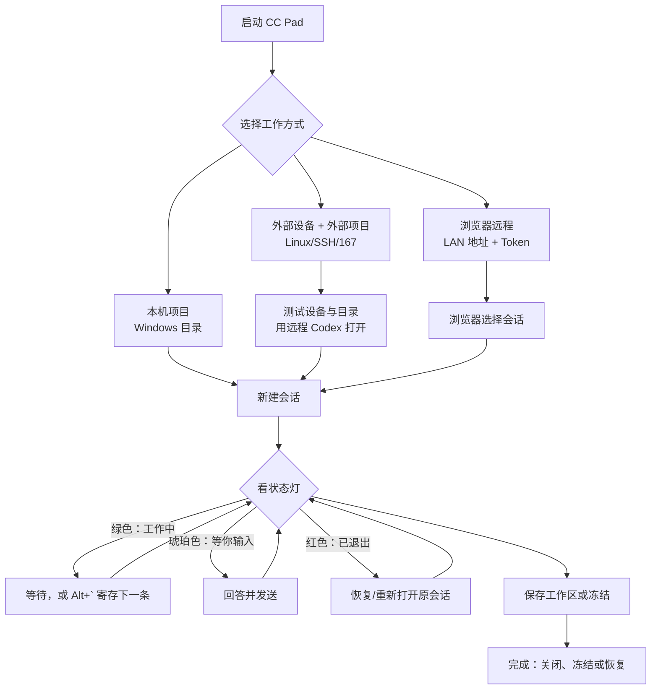

<p align="center">
  
</p>

<h1 align="center">CC Pad</h1>

<p align="center">
  AI CLI 多会话工作台 — 在单窗口中运行 Claude Code、本地 Codex 和远程 Codex 会话。
</p>

<p align="center">
  <a href="README.md">English</a> · <a href="LICENSE">许可证 (GPL-3.0)</a>
</p>

<p align="center">
  <em>⚡ 这是 <a href="https://github.com/nuomiaa/CCPad">nuomiaa/CCPad</a> 的社区 fork —— 增加了 Codex CLI 支持、每标签状态指示灯与后台"该你了"通知、9 种语言可切换界面、Chrome 式会话恢复、不死终端。基于 GPL-3.0 许可,原始版权归上游作者所有。详见<a href="#衍生版改动">衍生版改动</a>。</em>
</p>

---

> 当前版本：**v1.10.20**

## 功能特性

- **分屏** — 支持纵向和横向分屏，可拖拽调整比例。使用 `Alt+方向键` 在面板间快速切换。
- **标签页** — 每个面板支持多标签页，可拖拽排序，预热机制确保新建标签页即开即用。
- **标签标记与尺寸** *(fork)* — 为标签设置持久化标记，拖动调整共享页签栏高度，或拖动单个标签右边缘调整宽度。
- **工作区** — 将完整布局（分屏、标签页、工作目录、窗口状态）保存为 `.ccpad-workspace` 文件。启动时自动检测并恢复工作区。
- **冻结标签与模板** *(fork)* — 冻结空闲标签以释放资源，按需解冻，在分屏之间拖动活动标签，并通过 `.ccpad-template` 文件保存或恢复整个窗口布局。
- **资源保护** *(fork)* — 同时监控物理内存和系统提交量，在建议冻结空闲标签时显示非模态警告。
- **Codex 与 Claude 额度显示** *(fork)* — 左下角并排显示两个独立指示器，各自展示可读取的使用量和重置倒计时；启动时及每 5 分钟自动刷新。Claude 订阅额度无法读取时显示 `--`。
- **Codex Full Access 设置** *(fork)* — 「关于」菜单可将本地 Codex 默认保持在危险/全权限模式，也可关闭后恢复正常的确认和沙箱提示。新建、恢复、选择器、fork 以及退出后的恢复命令统一使用该设置。
- **面板级自动回车** *(fork)* — 底部「回车」只作用于当前本地 Claude/Codex 面板，识别到确认提示后只确认一次，不扫描远程面板或持续保留大段输出。
- **项目快速访问** — 固定常用目录，一键在新标签页中打开。
- **Windows ConPTY** — 原生伪控制台集成，可运行任何命令行工具 — PowerShell、cmd、bash、python、node、git 等。
- **xterm.js 渲染** — 通过 WebView2 承载 xterm.js，使用 Cascadia Code 字体进行完整终端模拟。
- **鼠标中键拖动滚动** *(fork)* — 在终端区域按住鼠标滚轮（中键）后上下拖动，可滚动终端历史；拖动时显示圆形 `↕` 指示器。松开中键、窗口失焦或页面隐藏时会自动结束手势。
- **Mica 背景** — 原生 Windows 11 半透明云母材质效果。
- **网页远程终端** — 内置 HTTP/WebSocket 服务器，可在局域网内通过浏览器实时查看和控制任意终端会话。支持可选的令牌认证。移动端友好，提供触屏虚拟按键。
- **右键菜单集成** — 在资源管理器中右键任意文件夹即可在 CC Pad 中打开。
- **文件关联** — 双击 `.ccpad-workspace` 或 `.ccpad-template` 文件直接打开。
- **本地与远程 CLI 模式** *(fork)* — 同一窗口可运行本地 Claude、本地 Codex，以及通过 SSH 和 tmux 连接的远程 Codex；可设置默认模式，也可用于固定项目。
- **多设备远程 Codex** *(fork)* — 管理多个 Linux SSH 设备和外部项目，每个远程标签使用独立的 `ccpad-*` tmux 会话，断开的旧会话会自动清理。
- **标签状态指示灯** *(fork)* — 本地 CLI 标签通过 Claude 官方 hooks 或 Codex 的 `notify` 配置显示:**绿色** = AI 正在工作,**琥珀色** = 正在等你输入,**红色** = CLI 已退出。Codex@167 v1 不打通远端到本机的 hook,因此只有 SSH 退出后的红灯状态可靠。
- **上一条命令栏** *(fork)* — 在每个终端顶部显示最近提交的命令；点击可复制全文，按 `Alt+L` 开关。
- **后台"该你了"通知** *(fork)* — 当后台标签里的会话开始等待你输入时,CC Pad 会弹出 Windows 通知;点击即可直接跳到那个标签。可在"关于"菜单中开关。
- **自动回复** *(fork)* — 可配置触发短语自动发送回复，并带有输入保护、冷却时间、重试上限和跨窗口偏好同步。
- **自动回车** *(fork)* — 可选在 CLI 显示确认提示时自动按下回车。
- **多语言界面** *(fork)* — 界面语言可即时切换(无需重启):**English、简体中文、繁體中文、Deutsch、日本語、Français、한국어、Español、Italiano**。首次运行跟随 Windows 显示语言。覆盖应用界面、资源管理器右键菜单文案以及远程网页。
- **一键恢复对话** *(fork)* — Claude 退出后,在提示符按 **↑** 即可预填精确的 `claude --resume <id>` 命令(确认后再回车),对话恢复后标签的红灯会变回琥珀色。
- **会话恢复** *(fork)* — Chrome 式崩溃恢复(默认开启):异常退出后恢复标签和工作目录。
- **不死终端** *(fork)* — CLI 退出后终端不再变死,自动落到同目录的 shell(保留滚动历史);按回车可重新启动 CLI。
- **文件管理器** *(fork)* — 右侧停靠面板,浏览当前会话的项目目录,可用右下角工具栏的「文件」按钮开关。
- **命令寄存** *(fork)* — AI 还在忙时,先把接下来要发的命令排进队列;会话一空闲,CC Pad 就自动逐条发送。用「寄存」按钮或在面板内按 ``Alt+` `` 切换;在寄存输入框里按 ``Alt+V`` 会把剪贴板里的图片存成 PNG 并把路径排进队列(Claude 通过路径附带图片)。
- **可切换主题** *(fork)* — 深色(默认纯黑皮肤)、浅色(半透明云母)或跟随系统,可在「关于」菜单中即时切换。

## 截图

Claude Code 与 OpenAI Codex 在分屏中并排运行 —— 注意每个标签上的彩色状态指示灯:


从「项目」菜单可用任一 CLI 打开固定的项目:


「关于」菜单 —— 会话恢复、后台「该你了」通知,以及语言切换:


### 多面板、混合 CLI 与恢复控制

下面的示例展示了四面板布局中同时运行 Codex 与 Claude、实时切换界面语言，以及寄存队列和会话恢复入口：


## 安装

### 安装程序（推荐）

从 [Releases](../../releases) 页面下载最新的 `CCPad-Setup-x64.exe` 并运行。

### 从源码构建

**前置条件：**
- [.NET 8.0 SDK](https://dotnet.microsoft.com/download/dotnet/8.0)
- [Windows App SDK 1.8+](https://learn.microsoft.com/windows/apps/windows-app-sdk/)
- Windows 10（Build 17763）或更高版本

```bash
# 克隆仓库（本 fork）
git clone https://github.com/vv-l/CCPad.git
cd CCPad

# 构建（Debug）
dotnet build CCPad/CCPad.csproj

# 构建（Release，x64）
dotnet publish CCPad/CCPad.csproj -c Release -r win-x64

```

支持平台：`win-x64`、`win-x86`、`win-arm64`。

### 更新检查

CC Pad 会在启动几秒后静默查询本 fork 的 GitHub Releases。发现新版本后，右下角工具栏会显示更新按钮；「关于」菜单中也有「检查更新」。如果当前架构有匹配安装包，程序会下载它，退出当前程序并启动安装器。当前发布流程只提供 **x64** 安装程序和便携 ZIP；x86、ARM64 可从源码构建，但暂时没有对应的公开发布包。

## 使用

### 启动

```bash
# 在当前目录打开
CCPad.exe

# 打开指定文件夹
CCPad.exe "C:\Projects\my-app"

# 打开工作区文件
CCPad.exe my-project.ccpad-workspace

# 在新窗口打开冻结模板
CCPad.exe my-layout.ccpad-template
```

无参数启动时，CC Pad 会自动检测当前目录下的 `.ccpad-workspace` 文件并进入工作区模式。

如果要让开发版或演示版与正式实例完全隔离，请在启动前设置 `CCPAD_DATA_DIR`。偏好、项目、恢复快照、模板、hooks、日志和锁文件都会改存到该目录：

```powershell
$env:CCPAD_DATA_DIR = "$PWD\.ccpad-demo-data"
.\CCPad.exe
```

### 推荐使用流程

下面按“你要在哪里工作”选择入口，再按卡片一步一步执行。**本机项目**指运行 CC Pad 的 Windows 电脑；**外部项目**指通过 SSH 连接的 Linux/167 设备；**浏览器远程终端**是从手机或另一台电脑查看这台 Windows 上的 CC Pad 会话。

#### 先选工作方式

| 你要做什么 | 点击哪里 | 成功后看到什么 |
|---|---|---|
| 在本机目录运行 Claude 或本地 Codex | **本地项目** → 选择 Windows 目录 → 新建会话 | 标签显示本机目录，命令在这台 Windows 电脑上运行 |
| 在 Linux/167 上运行远程 Codex | **外部项目** → 添加外部设备 → **测试设备连接** → 添加外部项目 → **用远程 Codex 打开** | 标签绑定设备和 Linux 绝对路径，每个标签使用独立 `ccpad-*` tmux 会话 |
| 用手机或另一台电脑查看当前会话 | 工具栏 **远程终端** → 启动 → 复制 LAN 地址/端口/Token | 浏览器打开 CC Pad 的网页镜像，再选择要查看的会话 |

#### 一眼看懂流程



不支持 Mermaid 的阅读器可以按这条文字路径理解：**选择入口 → 创建会话 → 观察状态灯 → 输入或寄存 → 检查输出 → 保存里程碑 → 关闭或恢复**。

#### 照着做：6 个实操步骤

| 步骤 | 操作 | 看到什么算成功 | 下一步 |
|---|---|---|---|
| 1. 选位置 | 本机项目选 Windows 目录；远程项目先选设备，再选 Linux 绝对路径 | 远程设备测试中的 SSH、Linux、目录、tmux、Codex 和登录检查通过 | 创建会话 |
| 2. 建标签 | 点击本地 Claude/本地 Codex，或点击 **用远程 Codex 打开** | 新标签出现，远程标签底部显示设备与远程工作目录 | 发第一条任务 |
| 3. 发目标 | 一条标签只放一个连续目标，例如“修复登录问题并运行测试” | AI 开始输出，标签状态灯变绿 | 等待或处理其他标签 |
| 4. 忙时寄存 | 按 ``Alt+` ``，输入下一条提示词；不要直接打断正在运行的终端 | 提示词出现在寄存列表，空闲后自动逐条发送 | 查看结果 |
| 5. 查证据 | 中键按住拖动查看历史；点击上一条命令栏复制；保留测试结果和关键决定 | 输出、命令和结果仍在同一标签中可回看 | 到里程碑保存 |
| 6. 收尾 | 保存工作区；需要释放资源就冻结；异常退出用恢复入口 | 下次打开可以恢复布局，远程会话继续连接原 tmux | 继续、关闭或恢复 |

#### 3 分钟上手

- **本机编码：** 本地项目 → 选择 `D:\\项目` → 新建本地 Codex → 输入目标 → 看到绿灯后等待，完成后保存工作区。
- **远程 Codex/167：** 外部项目 → 添加或选择设备 → 测试连接 → 添加 `/zettos/pool/1/agents/项目` → **用远程 Codex 打开**。每个标签有独立 `ccpad-*` tmux；SSH 断线或冻结只会 detach，明确关闭标签才会结束会话。
- **手机/浏览器查看：** 远程终端 → 启动 → 复制本机 LAN 地址和 Token → 在同一局域网浏览器打开 → 选择会话。远程 Codex 输出 `Opened … in your browser` 时，CC Pad 会尝试在运行 CC Pad 的 Windows 本机浏览器打开该链接；也可以直接点击终端中的蓝色链接。

#### 状态灯怎么处理

| 现象 | 现在做什么 | 不要做什么 |
|---|---|---|
| 绿色：AI 工作中 | 等待，或切到其他标签；后续提示用 ``Alt+` `` 寄存 | 反复按 Enter 或重复启动第二个会话 |
| 琥珀色：等待输入 | 直接回答；需要多条时先寄存 | 把无关任务继续堆进同一标签 |
| 红色：CLI 已退出 | 使用恢复入口或标签上的恢复操作 | 另开一份对话，造成重复执行 |
| SSH 断线 | 恢复原远程标签，保持原设备和项目绑定 | 立即在同一设备再开一个同名会话 |
| 设备测试失败 | 修正 IP、用户、私钥、目录或 Codex 登录后重新测试 | 未通过 readiness test 就直接启动远程会话 |

#### 常用检查点

| 目标 | 点击/快捷键 | 什么时候用 |
|---|---|---|
| 看较早输出 | 在终端按住鼠标中键上下拖动 | 长日志、测试失败、需要回看上下文 |
| 复制最近命令 | 点击“上一条”命令栏，或按 `Alt+L` 显示/隐藏 | 复用命令、记录复现步骤 |
| 暂存后续提示 | ``Alt+` `` | AI 正在工作但你已经知道下一步 |
| 保存布局 | 工作区菜单 → 保存 | 分屏、标签和目录已经适合下次继续 |
| 释放资源 | 冻结菜单 → 冻结空闲标签 | 暂时不需要 WebView/CLI，但以后还要回来 |
| 找回会话 | 会话恢复/恢复入口 | Windows、CC Pad 或 SSH 意外退出后 |

记忆口诀：**先选本机还是远程，再建一个目标一个标签；绿灯等待、琥珀灯回答、红灯恢复；中键回看，里程碑保存。**

### 快捷键

**标签与分屏**

| 操作 | 快捷键 |
|------|--------|
| 新建标签页 | `Ctrl+T` |
| 关闭标签页 | `Ctrl+W` |
| 向右分屏（纵向） | `Alt+Shift+=` |
| 向下分屏（横向） | `Alt+Shift+-` |
| 面板间导航 | `Alt+方向键` |
| 关闭当前面板 | `Ctrl+Shift+W` |

**字号**

| 操作 | 快捷键 |
|------|--------|
| 放大字号 | `Ctrl++` · `Ctrl+=` · `Ctrl+滚轮上` |
| 缩小字号 | `Ctrl+-` · `Ctrl+滚轮下` |
| 重置字号 | `Ctrl+0` |

**终端选择与复制**

| 操作 | 快捷键 |
|------|--------|
| 复制选中内容 | `Ctrl+C`（无选区时透传给 CLI） |
| 清空当前输入行 | `Alt+A` |
| 全选当前屏幕（便于复制） | `Alt+Shift+A` |
| 切换上一条命令栏 | `Alt+L` |

**鼠标中键拖动滚动**
在终端内容区域按住鼠标滚轮（中键），看到圆形 `↕` 指示器后上下拖动。向上拖动查看较早输出，向下拖动回到较新输出；松开中键结束。窗口失去焦点或页面隐藏时，CC Pad 会自动清理拖动状态。该手势只滚动终端历史，不改变终端行列尺寸；普通滚轮、`Ctrl+滚轮` 字号缩放和左键文本选择保持不变。

**命令寄存** *(fork)*

| 操作 | 快捷键 |
|------|--------|
| 切换寄存模式 | ``Alt+` `` |
| 入队当前条目 | `Enter`（`Shift+Enter` 换行） |
| 寄存框内全选 / 取消 | `Alt+A` |
| 寄存框内贴图（存为 PNG、路径入队） | `Alt+V` |

**恢复对话与文件面板** *(fork)*

| 操作 | 快捷键 |
|------|--------|
| 恢复上次 Claude 对话（CLI 退出落到 shell 后，提示符处） | `↑` |
| 文件面板 — 打开选中项（目录进入 / 文件用系统默认打开） | `Enter` |
| 文件面板 — 返回上级目录 | `Backspace` |

右键点击终端或标签页标题可查看更多选项。

### 网页远程终端

在同一局域网内的任意浏览器中访问你的终端会话：

1. 点击工具栏中的远程终端按钮
2. 选择局域网地址，设置端口（默认 `9220`），并决定端口被占用时是否自动递增
3. 可选择启用令牌认证
4. 在其他设备（手机、平板、另一台电脑）上打开显示的 URL
5. 从侧边栏选择一个会话，即可实时查看和控制

功能特性：
- **实时镜像** — 与桌面终端显示完全同步
- **完整键盘输入** — 远程输入命令
- **触屏控制** — 移动端提供虚拟方向键、退格和回车
- **会话回放** — 缓存近期终端输出，连接时即时显示
- **安全** — 可选 16 字节令牌认证。不启用令牌时，能访问监听地址的设备都可以控制列出的会话。

### 工作区

工作区以 JSON 格式保存完整布局：

- **分屏布局** — 面板树结构，包含方向和比例
- **标签页状态** — 每个标签页的名称和工作目录
- **窗口状态** — 大小、位置和最大化状态

使用工作区按钮（右上角，工作区模式下可见）或右键菜单来保存/加载工作区。默认文件名为当前目录名。同一菜单还管理冻结模板库：保存新的 `.ccpad-template`，在新窗口打开或恢复到当前窗口，并导入/导出模板文件。

### 会话与资源控制

- 右下角的**冻结**菜单可以冻结空闲标签、冻结全部标签，或解冻全部标签。冻结会释放标签的 CLI 和 WebView2 资源，并留下可点击解冻的占位符；远程会话会 detach，之后可以重新接回。自动冻结默认关闭，可设置为 CLI 空闲 30 分钟、1 小时、2 小时或 4 小时后执行。
- 「关于」→「恢复已关闭会话」最多保留最近 12 个布局。恢复会先把当前窗口存入历史，因此可以从同一菜单撤销；同一处可以关闭会话恢复或清除恢复数据。
- 右键标签可以设置或清除用户标记。标记、自定义标签宽度、远程设备 ID 和冻结状态都会保存到工作区、模板和恢复快照中。

### 安全与偏好

- **自动回车**和**自动回复**是两个独立的工具栏开关。自动回车会在检测到确认提示时按回车；自动回复会匹配面板输出中的词条，左键开关、右键编辑规则。每个词条有 30 秒冷却时间和重试上限。
- **额度指示器**分别显示 Codex 与 Claude。Codex 读取本地 `%CODEX_HOME%\auth.json`（未设置时使用 `%USERPROFILE%\.codex\auth.json`），Claude 读取本地 Claude Code OAuth 信息；访问令牌只用于内存中的 HTTPS 请求，不会写入 CC Pad 日志。API 计费模式或没有可读订阅额度的 Free 网页账号显示 `--`。
- 「关于」→「跳过权限提示」控制新启动的本地 Claude 标签；本 fork 默认开启（`--permission-mode bypassPermissions`）。需要 Claude 正常询问权限时请关闭它；已经运行的会话不会改变启动参数。
- 「关于」→「关闭前确认」控制关闭窗口时的确认对话框及“下次启动恢复”选项。

### 项目管理

点击任意标签栏右侧的 **本地项目** 按钮来管理固定的 Windows 目录。添加项目后即可在所有面板中快速创建对应目录的新标签页。

旁边的 **外部项目** 按钮管理 Linux SSH 设备和设备上的项目目录。先选择「添加外部设备」，填写设备名称、IP、端口、Linux 用户、私钥路径和默认工作目录，再用内置测试检查 SSH、Linux、目录、tmux、Codex CLI 与登录状态。设备保存到 `%LOCALAPPDATA%\CCPad\remote-devices.json`；旧版 Codex@167 配置会自动迁移。

设备就绪后选择「添加外部项目」，绑定设备并填写 `/zettos/pool/1/agents/myproject` 这样的 Linux 绝对路径。添加只登记目录，不启动会话；菜单项可直接点击或右键「用远程 Codex 打开」。项目保存到 `remote-projects.json`，设备 ID 和远程目录会随冻结、工作区及崩溃恢复持久化。

「新建远程 Codex 标签」与「恢复远程 Codex 对话」使用当前设备的默认工作目录。每个标签拥有独立的 `ccpad-*` tmux 会话：明确关闭标签会结束会话，冻结、跨面板移动、可恢复窗口关闭或 SSH 断线只会 detach，超期的断开会话由远程清扫器回收。

内置的 `codex-167` 设备默认以 `codex --yolo` 启动新会话，即跳过审批并使用最高权限；恢复选择器也继承该权限参数。读取设备配置时，旧的 `codex` 以及 `-s/--sandbox danger-full-access` 写法会自动归一为 `codex --yolo`。已经运行的 tmux 会话保持原启动参数，关闭后重新打开项目即可应用。

在远程 Codex 标签中，文本可以正常粘贴；使用 `Ctrl+V` 或 `Alt+V` 粘贴图片时，CC Pad 会把图片上传到设备的 `/tmp/ccpad-images`，再把远程路径填入 CLI，因此 SSH 用户需要对该目录有写权限。

### AI 快速接入

「外部项目」菜单可以复制一份 AI 接入提示词。开发工作区还提供可选的 `ccpad-onboard-linux-device` Skill，但它维护在本 Git 仓库之外，发布包中不包含。该 Skill 可以探测 Linux 环境并直接写入 CC Pad 设备/项目配置，也可以只返回检查结果和字段供用户半手动填写；不会保存密码、私钥内容、OpenAI 密钥或 Codex 登录凭据。

## 架构

```
CCPad/
├── App.xaml.cs              # 入口，启动逻辑，右键菜单注册
├── MainWindow.xaml.cs       # 窗口管理，工作区模式，更新 UI
├── SplitHost.xaml.cs        # 二叉分屏树布局引擎
├── TabPanel.xaml.cs         # 标签页生命周期，项目菜单，状态指示灯
├── TerminalPane.xaml.cs     # WebView2 + xterm.js 宿主，会话注册
├── UpdateChecker.cs         # GitHub 发布检查器，自动更新
├── Terminal/
│   ├── ConPtySession.cs     # Windows ConPTY 进程管理
│   └── PseudoConsoleApi.cs  # ConPTY Win32 API P/Invoke 绑定
├── Web/
│   ├── WebTerminalServer.cs # ASP.NET Core Kestrel HTTP/WebSocket 服务器
│   ├── WebTerminalSession.cs# 远程镜像 WebSocket 处理器
│   ├── TerminalSessionRegistry.cs # 会话追踪 + 输出环形缓冲区
│   ├── CliNotify.cs         # 接收 Claude/Codex 回合信号的本地回环端点   [fork]
│   └── WebTerminalHtml.cs   # 内嵌网页 UI（含 xterm.js）
├── Notify/
│   └── ToastService.cs      # 后台"该你了"Windows 通知                  [fork]
├── CodexQuota/
│   └── CodexQuotaService.cs # 本地 Codex 登录信息与额度接口             [fork]
├── Localization/
│   └── Loc.cs               # 9 语言字符串表 + 即时切换                 [fork]
├── Files/
│   └── FileManagerPanel.xaml.cs # 右侧停靠的项目文件浏览器              [fork]
├── Controls/
│   └── GridSplitter.cs      # 可拖拽分屏比例控件
├── Settings/
│   ├── WorkspaceConfig.cs   # .ccpad-workspace 文件读写
│   ├── ProjectConfig.cs     # 项目列表持久化
│   ├── AppConfig.cs         # 应用偏好(默认 CLI、语言、开关)  [fork]
│   ├── CliMode.cs           # Claude/Codex 解析 + cmd /c 包裹  [fork]
│   ├── CliSessions.cs        # 会话 ID 发现与对话定位             [fork]
│   ├── FrozenTemplateStore.cs # .ccpad-template 模板库            [fork]
│   ├── ResourceGuard.cs      # 物理内存与系统提交量警告           [fork]
│   ├── AppPaths.cs          # 数据根目录解析(CCPAD_DATA_DIR 覆盖) [fork]
│   ├── ThemeManager.cs      # 深色/浅色/系统 主题状态 + 事件    [fork]
│   ├── SessionRecovery.cs   # 崩溃恢复快照与已关闭会话历史       [fork]
│   ├── RemoteDeviceConfig.cs # SSH 设备定义与迁移                [fork]
│   ├── RemoteDeviceConnection.cs # SSH 就绪检查                  [fork]
│   ├── RemoteProjectConfig.cs # 外部项目持久化                   [fork]
│   └── RemoteSessions.cs    # 每标签 tmux 会话与旧会话清扫       [fork]
└── Assets/
    └── xterm/               # xterm.js 终端模拟器
```

**渲染管线：** xterm.js (JavaScript) → WebView2 (Chromium) → WinUI 3 窗口

**布局模型：** `SplitNode` 二叉树 — 叶节点为包含 `TabPanel` 的 `PaneNode`，内部节点为带方向和比例的 `SplitContainerNode`。

## 系统要求

- Windows 10 版本 1809（Build 17763）或更高版本
- WebView2 运行时（Windows 11 已内置，Windows 10 会自动安装）

## 衍生版改动

本项目是 [nuomiaa/CCPad](https://github.com/nuomiaa/CCPad) 的社区 fork(基于上游 **v1.0.2**)。本 fork 的改动:

### v1.10.22

- **统一终端环境修复** — 所有 ConPTY 子进程统一使用 `TERM=xterm-256color`，覆盖新建标签页、恢复会话、回退命令行和 SSH 重连。即使启动 CC Pad 的环境带有 `TERM=dumb`，本地 Codex 也不会因此提示终端不受支持，远程 tmux 也不会因此报 `terminal does not support clear`。

### v1.10.21

- **自动输入交接修复** ——「回车」会保留短暂的提示尾部；即使开启开关时 Codex 确认框已经显示，也能识别并确认。「回车」和「应答」发送期间会占用输入闸门，寄存命令不会与它们的文本或回车键串写；面板再次报告空闲后，寄存队列才继续发送。
- **三个开关的职责更清楚** ——「回车」处理当前本机面板的确认提示；「应答」仍只匹配已配置的输出词条；「寄存」为当前面板排队，并在空闲时发送。三者可以同时开启，不会合并输入。

### v1.10.20

- **远程浏览器桥接复核修复** — 处理完成后从远程输出缓存中移除已识别的链接，避免无关输出到来时再次打开旧链接。

### v1.10.19

- **远程链接回到本机浏览器** — 远程 Codex 输出 `Opened https://… in your browser` 时，CC Pad 会尝试在运行 CC Pad 的 Windows 本机浏览器打开链接。点击终端蓝色链接也使用同一套本机浏览器 fallback；如果 Windows 无法启动浏览器，终端会给出可操作提示。

### v1.10.18

- **Codex 恢复命令修复** — 在注入 `codex resume` 前，改用 Windows `cmd.exe` 支持的 Esc 清空输入行。此前发送 `Ctrl+U` 会被回显成 `^U`，可能把恢复命令变成 `^Ucodex` 并导致“不是内部或外部命令”错误。

### v1.10.17

- **终端中键拖动滚动** — 在终端区域按住鼠标滚轮（中键）上下拖动滚动 xterm 历史，显示圆形 `↕` 指示器；释放中键、失焦或页面隐藏时自动清理。中键拖动不会改变终端行列尺寸，也不影响普通滚轮、`Ctrl+滚轮` 字号调整或左键文本选择。发布 tag：`v1.10.17`（commit `0c304a7`）。

### v1.10.16

- **退出恢复布局修复** — 先排队显示恢复提示，再启动兜底 shell；按 ↑ 注入恢复命令前清空 shell 输入行，避免第一次退出/恢复时提示符和命令重叠。

### v1.10.15

- **长文本寄存提交修复** — 根据 UTF-8 内容大小自适应等待后再发送回车，确保较长 Codex 内容完全写入输入框后提交；短内容仍走快速路径。

### v1.10.14

- **自动回车方案复核** — 保留底部「回车」作为明确的当前面板兜底开关；关于菜单的权限选项改为明确的启动参数说明。自动确认只处理本地 Claude/Codex，改用短增量匹配和一次性定时器，避免多窗口输出时重复扫描大缓冲区。

### v1.10.13

- **可配置的 Codex 危险模式** — 在「关于」菜单增加本地 Codex Full Access 开关，默认开启以保持原有行为；新建、恢复、恢复选择器、fork 和退出后的恢复命令统一应用设置，并始终保留 `--no-daemon`，避免管理员宿主把管理员权限传给 Codex daemon。

### v1.10.12

- **Codex daemon 隔离** — 本地 Codex 新建、恢复、恢复选择器、fork 以及退出后的快捷恢复命令统一加入 `--no-daemon`，避免继承管理员 daemon，重启 CC Pad 后可正常恢复对话。

### v1.10.11

- **Codex 额度显示** — 在左下角工具栏显示已登录账号的方案、当前窗口/每周使用量、重置时间和可用重置次数。
- **Codex / Claude 恢复入口** — 本地项目菜单提供「恢复 Codex」和「恢复 Claude」，直接打开对应 CLI 的 resume 选择器。
- **退出后的精确恢复提示** — Codex 和 Claude 退出后保留已识别的会话 ID，提示可执行的恢复命令；按 ↑ 可将命令放回 shell 输入行。
- **多进程布局恢复** — 多个 CC Pad 窗口同时启动时，每个进程只消费自己的恢复快照，不会清掉其他窗口待恢复的布局。
- **提升权限下的 CLI 启动** — 从管理员终端启动 CC Pad 时，子 CLI 使用普通用户令牌运行，避免 Codex 后台 daemon 继承管理员权限。
- **多分屏语言切换修复** — 分屏布局重建后，所有面板会继续接收语言切换事件；四个窗口同时切换语言时，项目按钮、外部项目按钮和工作区相关文案会一起更新。
- **现有界面即时刷新** — 已打开标签页菜单、冻结占位页、终端错误页、文件面板和寄存页面会立即使用新语言，寄存页面的说明文字也保持简洁。

### v1.10.10

- **多设备远程 Codex** — 可添加、编辑、测试和选择多个 Linux SSH 设备及外部项目。每个远程标签拥有独立的 `ccpad-*` tmux 会话，断开的旧会话会自动清理。旧版 Codex@167 配置会迁移到内置的 `codex-167` 设备，新会话默认使用 `codex --yolo`。
- **远程项目持久化** — 外部设备 ID 和 Linux 项目目录会随工作区、标签冻结和崩溃恢复保留；远程 Codex 标签支持新建会话和恢复已有对话。
- **自动回复与状态恢复** — 触发回复具备冷却时间、重试上限和输入保护；额度停滞及增量输出会及时更新状态灯，不再依赖过期 hook。
- **标签和寄存体验改进** — 拖动标签右边缘调整宽度（72–640 像素），双击恢复默认值；寄存命令支持拖动排序，标签宽度等设置会持久化。
- **本地化与接入引导** — 远程设备流程和 AI 接入提示词已补齐支持的界面语言；设备准备 Skill 仍是仓库外的开发工作区工具。

### v1.9.0（里程碑提交，未创建 tag）

- **冻结模板库** — 在工作区菜单中以 `.ccpad-template` 文件保存、恢复、覆盖、重命名、导入和导出整个窗口布局。
- **提交量感知的资源警告** — 内存压力提示现在同时跟踪系统提交量和物理内存，并建议冻结空闲标签。
- **本地化补全** — 右下角工具栏、文件管理器、终端错误覆盖层以及页面内寄存界面都会跟随当前语言。

### v1.8.0（里程碑提交，未创建 tag）

- **会话恢复重做** — 增加按进程快照、已关闭会话历史、更可靠的会话归属，以及缺失或快速退出会话的明确提示。
- **冻结/解冻生命周期** — 支持点击解冻占位符、可选自动冻结、复用预热渲染器，并在解冻失败时安全恢复占位符。
- **跨面板拖动标签** — 在分屏之间移动活动标签而不关闭会话；冷启动解冻时可以并行启动 CLI 和渲染器。

### v1.5.0–v1.7.x（连续迭代，未单独创建 tag）

- **v1.5.0 上一条命令栏** — 在每个终端顶部显示最近提交的命令，点击可复制全文，`Alt+L` 可全局开关；命令来自真实 PTY 输入流，支持 Claude、Codex 和 shell。
- **v1.6–v1.7 稳定性迭代** — 持续完善命令寄存、状态指示灯、终端显示和主题体验；这些提交没有单独的 Git tag，现按连续迭代归档在此处。
- **版本登记说明** — 仓库历史中 v1.4.0 与 v1.10.10 有正式 tag，v1.5.0–v1.9.0 是里程碑提交或本地发布记录，README 现将它们全部列出。

### v1.4.0

- **文件管理器面板** — 右侧停靠的文件浏览器,展示当前会话的项目目录,由右下角新增的「文件」按钮开关(`Files/FileManagerPanel.xaml`)。
- **命令寄存模式** — AI 还在干活时,先把接下来要发的命令排进队列;会话一空闲,CC Pad 就自动逐条发送。用「寄存」按钮或在面板内按 ``Alt+` `` 切换。在寄存输入框里按 ``Alt+V`` 会读取剪贴板图片、存成临时目录下的 PNG 并把路径排进队列(Claude Code 通过路径附带图片)——因为寄存输入框拦截了按键,CLI 自己读不到这次剪贴板。
- **更聪明的状态指示灯** — 琥珀色「该你了」灯现在能自我纠正过期的 hook 信号:hook 可能在一个回合中途把面板翻成「等待」,所以 CC Pad 只有在输出真正安静下来后才让灯保持琥珀(还在干活的 CLI 会持续重绘转圈动画,这会把灯保持为绿色)。检测到致命 API 错误横幅(如 `API Error: 529 Overloaded`、402 计费、403 鉴权)时,即使 CLI 仍停在提示符存活,也会强制亮**红灯**并跨过回合结束的 hook 一直保持到你重试。
- **可切换主题(深色 / 浅色 / 跟随系统)** — 纯黑皮肤现在是「关于」菜单中的一个选项;浅色恢复半透明云母外观,跟随系统则跟随 Windows。界面外壳通过 XAML `ThemeDictionaries`(`App.xaml`)切换,终端面板则通过 `Settings/ThemeManager.cs` 实时重新设置 xterm 前端样式。
- **隔离的数据目录** — 设置 `CCPAD_DATA_DIR` 环境变量,可让第二个实例(与正式安装并行启动的开发/演示版)拥有完全独立的配置档 —— 偏好、项目、崩溃恢复快照、锁文件、hooks 和日志 —— 从而绝不污染正式实例的会话状态。所有数据根路径现在统一经过 `Settings/AppPaths.cs`。
- **右下角工具栏重做** — 统一的 **文件 / 回车 / 寄存 / 关于** 按钮组(自动回车现在是一个一等的开关按钮,而非隐藏的开关)。版本号升到 1.4.0。

### v1.1.0

- **标签状态指示灯** — 每个标签带一个彩色圆点反映会话状态:绿色(AI 工作中)、琥珀色(等你输入)、红色(CLI 已退出)。由 Claude 官方 hooks 和 Codex 的 `notify` 配置通过一个本地回环端点(`Web/CliNotify.cs`)驱动,是事件触发而非抓屏识别。
- **后台"该你了"通知** — 当后台会话切换到"等待输入"时,CC Pad 弹出 Windows 通知(`Notify/ToastService.cs`);点击通知会聚焦到对应来源标签。可在"关于"菜单开关,状态存入应用偏好。
- **一键恢复对话** — Claude 退出后,在提示符按 ↑ 即可预填解析好的 `claude --resume <id>` 命令供确认后提交;对话恢复后标签灯变回琥珀色。
- **9 语言可切换界面** — English、简体中文、繁體中文、Deutsch、日本語、Français、한국어、Español、Italiano,通过自定义字符串表(`Localization/Loc.cs`)和 `LanguageChanged` 事件即时切换、无需重启。首次运行跟随 Windows 显示语言;选择覆盖应用界面、资源管理器右键菜单文案和远程网页,并存入应用偏好。
- **右上角自适应布局** — 工作区/项目按钮以及标签栏预留区现在根据测量出的文案宽度自适应,不再用固定边距,使较长的本地化文案(如 "Espacio de trabajo"、"Projekte")不再溢出或被裁剪。版本号升到 1.1.0。

### v1.0.x

- **双 CLI(Claude + Codex)** — 同窗口混开 Claude/Codex 标签;按 PATH/PATHEXT 解析真实可执行文件,`.cmd`/`.bat` 用 `cmd /c` 包裹(修复 `codex.cmd` 的 "CreateProcess failed: 2");默认 CLI 偏好和每个标签的 CLI 类型在重启后保留。
- **会话恢复** — Chrome 式崩溃恢复(默认开启);状态存于 `%LOCALAPPDATA%\CCPad\sessions\`;恢复标签和工作目录。
- **不死终端** — 伪控制台生命周期独立于子进程;CLI 退出后落到 `cmd.exe`(保留滚动历史)并提示按回车重启;用 `WaitForSingleObject` 可靠检测进程退出。Claude 异常退出时还会打印精确的 `claude --resume <id>` 命令(从磁盘上的会话记录解析得到),便于恢复对话。
- **Ctrl+滚轮缩放修复** — 关闭 WebView2 内置页面缩放(其持久化的 `ZoomFactor` 会累计逼近 ~5× 上限,导致面板用久后"能缩小却不能放大");现在 Ctrl+滚轮改为调整终端字号(钳制 8–40),并支持 Ctrl `+` / `-` / `0` 键盘缩放。版本号升到 1.0.6。
- **构建修复** — 关闭 trim(它曾裁掉 `WinRT.Runtime` 方法导致启动崩溃 `MissingMethodException`);版本号升到 1.0.4。

遵循 GPL-3.0,保留原始版权与许可证,改动在此处及提交历史中记录。

## 许可证

本项目基于 [GNU 通用公共许可证 v3.0](LICENSE) 授权,与上游项目相同。原始版权归上游 [nuomiaa/CCPad](https://github.com/nuomiaa/CCPad) 作者所有;fork 改动版权归各自贡献者所有。

## 参与贡献

欢迎贡献代码！请先创建 Issue 讨论你想要更改的内容。

1. Fork 本仓库
2. 创建你的功能分支（`git checkout -b feature/my-feature`）
3. 提交更改
4. 推送分支并创建 Pull Request
